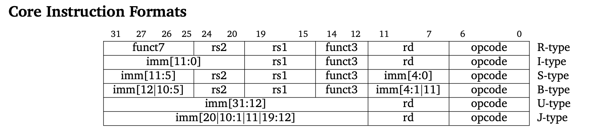

# АВС ДЗ №1

## Демченко Георгий Павлович, БПИ-235

### [Видео](https://disk.yandex.ru/i/-a_slsnTshg7jg) на доп. балл

### Системные вызовы , использованные в программах

```assembly
li a7 N
ecall
```

### где N:

- 1 - PrintInt, вывод числа из регистра a0 в консоль
- 4 - PrintString, вывод строки из адерса в памяти, куда указывает регистр a0, в консоль
- 5 - ReadInt, чтение числа из консоли  и запись в регистр a0
- 10 - Exit, завершение программы с кодом 0

## 1. add-int01.asm

```assembly
main:        
        li      a7 5
        ecall
        mv      t0 a0
        ecall
        add     a0 t0 a0
        li      a7 1
        ecall
        li      a7 10
        ecall
```

### Результат ассмеблирования


### Использованные псевдокоманды: **li**, **mv**

## 2. hello1.asm

```assembly
.text
        la a0, string   # buffer
        li a7, 4
        ecall
        li a0, 0
        li a7, 10
        ecall
.data
    string:  .asciz "Hello! It works!!!\n"
```

### Результат ассмеблирования


### Использованные псевдокоманды: **li**, **la**

## 3. hello2.asm

```assembly
    .data
hello:
    .asciz "Hello, world!"

    .text
main:
    li a7, 4
    la a0, hello
    ecall
```

### Результат ассмеблирования


### Использованные псевдокоманды: **li**, **la**

## 4. hello3.asm

```assembly
.text
        la a0, string   # buffer
        li a7, 4
.data
    string:  .asciz "Hello! It works!!!\n"
.text
        ecall
        li a0, 0
        li a7, 10
        ecall
```

### Результат ассмеблирования


### Использованные псевдокоманды: **li**, **la**

## 5. hello-ru.asm

```assembly
.text
        la a0, string       # buffer
        li a7, 4
        ecall
        li a0, 0
        li a7, 10
        ecall
.data
    string:  .asciz "Привет. Русский язык выглядит так!!!\n"
```

### Результат ассмеблирования


### Использованные псевдокоманды: **li**, **la**

## 6. add-int02.s

```assembly
#Записываем в память строки и создаем указатели (лейблы) на их адреса в памяти
.data
    arg01:  .asciz "Input 1st number: "
    arg02:  .asciz "Input 2nd number: "
    result: .asciz "Result = "
    ln:     .asciz "\n"
    
.text	
        la 	a0, arg01   #Записываем в a0 адрес в памяти где содержится строка с лейблом arg01
        li 	a7, 4       #Записываем в a7 значение 4 - PrintString
        ecall		    #Системный вызов - вывод знаечения (строки по указателю) из a0 в консоль
        li  a7 5        #Записываем в a7 значение 5 - ReadInt
        ecall           #Системный вызов - читем число из консоли и записываем значение в a0
        mv  t0 a0       #Сохраняем значение из a0 в t0
	
	#Аналогично предыдущему
        la 	a0, arg02   
        li 	a7, 4       
        ecall
        li   a7 5        
        ecall               
        mv   t1 a0  
	
	#Частично аналогично
        la a0, result       
        li a7, 4            
        ecall		    
        add     a0 t0 t1    #Записываем сумму значений t0 и t1 в a0
        li      a7 1        #Записываем в a7 значение 1 - PrintInt
        ecall               #Системный вызов - вывод знаечения (числа) из a0 (полученная сумма t0 + t1) в консоль
	
	#Аналогичная запись указателя в a0 и вывод в консоль
        la a0, ln           
        li a7, 4           
        ecall

        li  a7 10   #Записываем в a7 значение 10 - Exit
        ecall		#Системный вызов - завершение программы с кодом 0
```

### Результат ассмеблирования


### Типы форматов инструкций в программе add-int02.s :
- **la** : псевдокоманда, раскладывается в auipc (U-type) и addi (I-type)
- **li** : псевдокоманда, раскладывается в addi (I-type)
- **ecall** : I-type
- **mv** : псевдокоманда, раскладывается в add (R-type)
- **add** : R-type

### Форматы инструкций



### Использованные псевдокоманды: **li**, **la**, **mv**