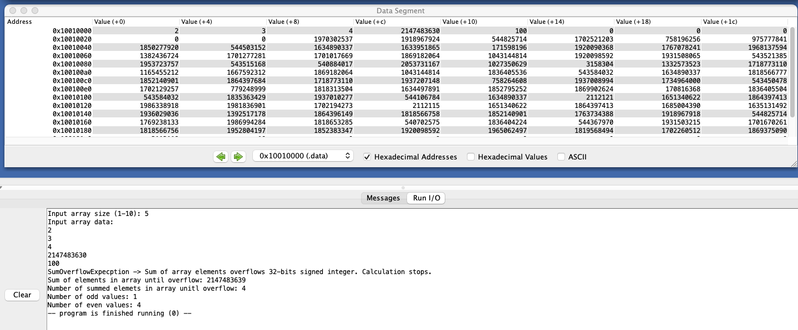
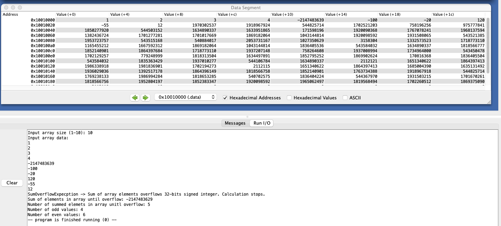
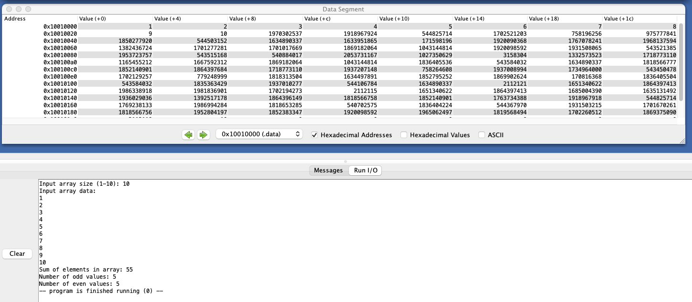

# АВС ДЗ №4

## Демченко Георгий Павлович, БПИ-235

## Documentation | [array_sum.s](https://github.com/AvtorPaka/CSA_RISC-V/tree/master/src/Homework/Hw_4/array_sum.s)

### 0. Program goal

* Develop a program that sums signed integer elements of a one-dimensional array. The number of elements in the array can vary from 1 to 10. It is necessary to control that the number of entered numbers does not exceed the maximum allowable.  

* Summation is carried out after placing the array in memory. The amount is calculated after entering the specified number of numbers. In the case when a positive or negative overflow occurs, it is necessary to display the last correct value of the sum and the number of elements summed.

### 0.1 Bonus

* Count the number of even and odd elements in the input array. The calculation is carried out in an array that is already located in memory after entering numbers. Counting is carried out for all entered elements, regardless of whether there was an overflow during summation or

### 1. Registers usage

| **Register** |  **Purpose**  |
| --------- | ------------------ |
| **a0** | Storing values for/from syscals |
| **a1** | Storing type of MessageDialog for 55 syscal (always 0 for Exception/Error message) |
| **a7** | Storing syscals types  |
| **ra** |  Storing caller CP for **check_array_size**, **fill_array**, **calculate_sum** functions |
| **s0** |  Storing int32_t MAX_VALUE = 2^31 - 1 |
| **s1** |  Storing int32_t MIN_VALUE =  -2^31 |
| **s2** |  Storing sum overflow flag (0 if overflow, 1 overwise) |
| **s3** | Storing sum of elements in array (until sum overflow) |
| **s6**  | Storing value until sum overflow on every itteration of array |
| **s7** | Storing flag for odd/even numbers (0 -> even, 1 -> odd) |
| **t0** | Storing array size ( 1 <= _size <= 10 ) |
| **t1** | Storing values to store in memory (array) -> Storing max size value (10) -> Storing values taken from memory (array) |
| **t2** | Storing counter for iterating throught array (For storing values in memory and loading them) |
| **t3** | Storing count of odd array values -> Storing count of even array values (t3 = t0 - t3) |
| **t4** | Storing count of summed array elements (untill sum overflow) |
| **t6** | Storing address of array |

### 2. Functions usage

| **Function** |  **Usage**  |
| --------- | ------------------ |
| **main**  | Program entrypoint |
| **calculate_sum**  | Calculates sum of elements in array (memory), number of odd/even numbers in array, number of summed values in sum overflow case, checks for sum overflow|
|  **fill_array** | Stores inputed in console values in memory (array)  |
|  **check_array_size** | Check that the inputed array size is valid ( 1<= _size <= 10), otherwise calls **throw_out_of_range_exception**|
|  **throw_out_of_range_exception** | Throws ArraySizeOutOfRangeException in Rars MessageDialog and console, call **exit_program**|
|  **throw_sum_overflow_exception** | Throws SumOverflowExpecption in Rars MessageDialog and console, output sum until overflow and number of summed elements in console, call **exit_program**  |
|  **f_ouput_sum** | Output calculated sum in console |
|  **output_odd_even** | Output number of odd and even values in array in console |
|  **exit_program** |  Clear used registers, ends program execution |

## Examples of program execution

### Positive overflow

### Negative overflow

### No overflow

