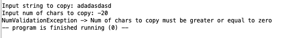
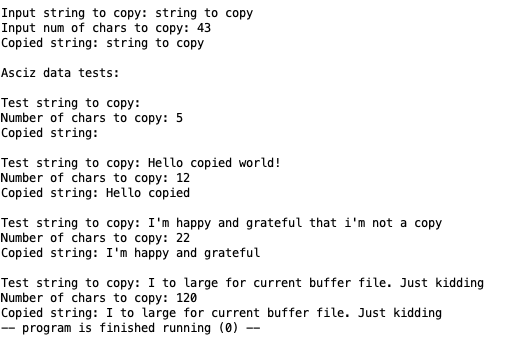
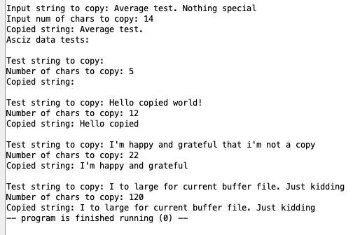
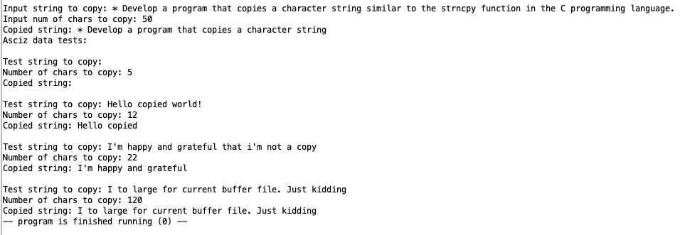
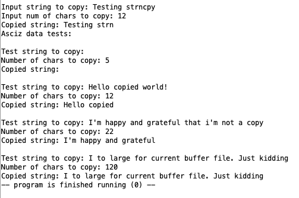

# АВС ДЗ №6

## Демченко Георгий Павлович, БПИ-235

## Documentation | [strncpy.s](https://github.com/AvtorPaka/CSA_RISC-V/tree/master/src/Homework/Hw_6/strncpy.s)

### 0. Program goal

* Develop a program that copies a character string similar to the strncpy function in the C programming language.

* Test the function on various combinations of data. Specify the initial data for testing both when entering from the console and using character strings in the program being developed (similar to the programs discussed at the seminar). Move the subroutine to a separate file, ensuring multi-file compilation.

* Develop a macro that wraps it, thereby expanding the macro library of character strings, while maintaining separate placement and translation of previously developed code.

### Local launch in RARS

**Since all the assembler files necessary to run the main and test programs are located in one directory, you should use the following execution settings in the RARS environment**

### 1. Behaviour

- **If the end of the source C string (which is signaled by a null-character) is found before num characters have been copied, destination is padded with zeros until a total of num characters have been written to it.**

- **This behavior was redefined to combat memory leaks and the inconvenience of manually adding a null-char to the end of a string after calling strncpy.**
    - **No null-character is implicitly appended at the end of destination if source is longer than num. Thus, in this case, destination shall not be considered a null terminated C string (reading it as such would overflow).** 

- **Additionally, a check for num being non-negative has been implemented (in C num is unsigned)**

## 2. Examples of program ([test_strncpy.s](https://github.com/AvtorPaka/CSA_RISC-V/tree/master/src/Homework/Hw_6/test_strncpy.s)) execution

## Invalid num

## Average tests

|   |
| --------------- |
|   | 
|  |
|   |
|   |