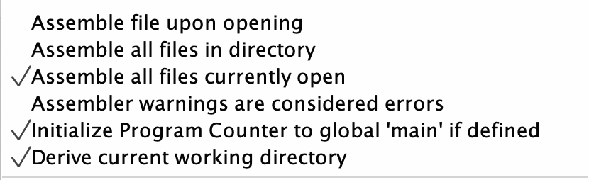
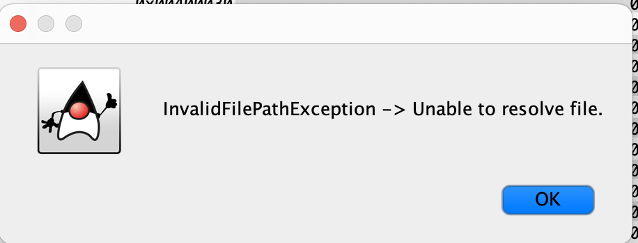
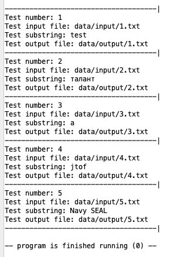

## Демченко Георгий Павлович, БПИ-235

## ИДЗ №3, Варинат №24

## Индивидуальное условие №24

* Разработать программу, которая ищет в ASCII–строке заданную подстроку и возвращает список индексов первого символа для всех вхождений подстроки в строке. Подстрока вводится как параметр. Вывод результатов организовать в файл (используя соответствующие преобразования чисел в строки).

## Условия задания

* Разработанная программа должна читать обрабатываемый текст из файла и загружать полученные результаты также в файл. Ввод имен входного и выходного файлов должен осуществляться с использованием консоли. Аналогичным образом осуществляет ввод остальных параметров, необходимых для выполнения программы.

## Локальный запуск в среде RARS

**Так как все необходимые для запуска основной и тестировочной программы ассемблерные файлы расположены в одной директории и пути до файлов чтения/записи относительны, следует использовать следующие настройки исполнения в среде RARS**

**В разделе документации каждой основной программы указано, какие файлы необходимо открыть для успешного исполнения.**

## Документация | [macrolib.s](https://github.com/AvtorPaka/CSA_RISC-V/tree/master/src/IndHW/FindSubstrIdx/macrolib.s)

|  **Макрос** | **Назначение**  |  **Передаваемые параметры** | **Возвращаемое значение** 
| ---------- | -------------- |  ------------ | ------------ |
|  **strncpy** | Макрос-обертка над попдрограммой копирования символов строки  | **%dest** - адрес области памяти, кула будет скопирована часть строки   **%source** - область памяти (не нуль-терминированная строка), откуда будут скопированы num символов   **%num**- 32-битное число, определяющее количество первых символов source для копирования в destination  |  **a0** - адрес начала области памяти, куда скопирована часть строки |
|  **load_from_file_func** | Макрос-обертка над попдрограммой загрузки данных из файла  |  **%pathB** - указатель на область памяти со строкой - путем к файлу   **%pathS** - максимальный размер буффера пути к файлу (256)   **%dataB** - буффер для хранения части текста при считывании   **%datas** - максимальный размер временного буффера (512) |  **a0** - адрес в динамической памяти (heap), где размещены данные |
| **load_and_input_from_file_func**  |  Макрос-обертка над попдрограммой ввода пути к файлу через диалоговое окно и загрузки данных из файла |  **%pathB** - указатель на область памяти со строкой - путем к файлу   **%pathS** - максимальный размер буффера пути к файлу (256)   **%dataB** - буффер для хранения части текста при считывании   **%datas** - максимальный размер временного буффера (512) |  **a0** - адрес в динамической памяти (heap), где размещены данные |
| **upload_to_file_func** | Макрос-обертка над попдрограммой загрузки данных в файл  |  **%pathB** - указатель на область памяти со строкой - путем к файлу   **%pathS** - максимальный размер буффера пути к файлу (256)   **%dataB** - адрес памяти на куче где хранится строка для записи в файл   **%dataS** - размер записываемой строки в байтах | **Нет**  |
|  **upload_to_file_input_func** |  Макрос-обертка над попдрограммой ввода пути к файлу через диалоговое окно и загрузки данных в файл|  **%pathB** - указатель на область памяти со строкой - путем к файлу   **%pathS** - максимальный размер буффера пути к файлу (256)   **%dataB** - адрес памяти на куче где хранится строка для записи в файл   **%dataS** - размер записываемой строки в байтах | **Нет**  |
| **find_substr_idx_func** |  Макрос-обертка над попдрограммой для поиска индексов первого символа для всех вхождений подстроки в строку | **%data** - область памяти, где расположена строка(текст) , где происходит поиск   **%substr** - область памяти, где расположена подстрока для поиска вхождений  | **a0** - указатель на начало области памяти в куче, где расположены нужные индексы - 32-битные целые числа (массив)   **a1** - размер полученного массива  |
|  **upload_to_console_func** | Макрос-обертка над попдрограммой вывода резульатов в консоль  | **%arr** - адресс начала области памяти с массивом 32-битных чисел   **%size** - размер массива  | **Нет** |
|  **convert_array_to_string_func** | Макрос-обертка над попдрограммой для перевода массива 32-битных чисел в строку  | **%arr** - адресс начала области памяти с массивом 32-битных чисел   **%size** - размер массива   **%buff** - адрес начала буффера для временной записи строкового представления числа  | **a0** - адрес области памяти в куче с итоговой строкой   **a1** - размер итоговой строки в байтах  |
|  **chose_output** |  Выбор пользователем способа вывода полученных данных в файл или консоль |  **Нет** |  **a0** - 0 при выводе в консоль, 1 при выводе в файл |
| **strlen**  | Нахождение длинны нуль-терминированной строки  | **%str** - строка для поиска длинны  | **a0** - длинна строки  |
| **next_space** | Вывод разделители ';' в консоль  | **Нет**   | **Нет**  |
| **throw_num_arg_validation_error** |  Выброс исключения валидации параметра num функции strncpy и завершения программы | **Нет**   | **Нет**  |
|  **throw_invalid_file_path_error** |  Выборс исключения неверного пути к файлу и завершение программы | **Нет**   | **Нет**  |
|  **throw_read_error** |  Выброс исключения при плохом чтении из файла и завершение программы | **Нет**   | **Нет**  |
| **input_substring**  | Ввод подстроки для поиска в тексте  | **%strbuf** - регистр с адресом буффера куда будет записана строка   **%size** - регистр с 32-битным числом, ограничивающим размер вводимой строки  | **Нет**  |
| **str_get**  | Ввод строки в буфер заданного размера с заменой перевода строки нулем  |  **%strbuf** - регистр с адресом буффера куда будет записана строка   **%size** - регистр с 32-битным числом, ограничивающим размер вводимой строки  | **Нет**  |
| **str_get_dialog**  | Ввод строки в буфер заданного размера через диалговое окно с заменой перевода строки нулем |  **%dialogString** - адрес строки для вывода в диалоговое окно   **%strbuf** - регистр с адресом буффера куда будет записана строка   **%size** - регистр с 32-битным числом, ограничивающим размер вводимой строки  | **Нет**  |
|  **open_and_validate** | Открытие файла для чтения, записи, дополнения с дополнительной валидацией корректности открытия  | **%file_name** - адрес строки с путем к файлу   **%opt** - опция открытия файла (READ_ONLY - 0, WRITE_ONLY - 1, APPEND - 9)  |  **a0** - дескриптор открытого файла |
| **read** | Чтение информации из открытого файла  | **%file_descriptor** - дескриптор файла   **%strbuf** - буффер для записи текста из файла   **%size** - максимальное количество байтов для чтения и записи в буффер  |  **a0** - длинна прочитаной строки или -1 в случае неудачного чтения |
|  **read_addr_reg** | Чтение информации из открытого файла, когда адрес буфера в регистре  | **%file_descriptor** - дескриптор файла   **%strbuf** - буффер для записи текста из файла   **%size** - максимальное количество байтов для чтения и записи в буффер  |  **a0** - длинна прочитаной строки или -1 в случае неудачного чтения |
|  **close** | Закрытие файла  |  **%file_descriptor** - декскриптор файла | **Нет**  |
| **allocate**  |  Выделение области динамической памяти заданного размера | **size** - количество байт для выделения  | **a0** - адрес начала выделенной области памяти  |
| **print_string**  |  Вывод строки в консоль | **%str** - лейбл с строкой, значение которой будет выведено в консоль | **Нет**  |
| **print_int**  |  Вывод целого числа в консоль | **%num** - регистр, значение которого будет выведено в консоль  |  **Нет** |
| **print_char**  | Вывод символа в консоль  | **%x** - символ для вывода в консоль  | **Нет**  |
| **newline**  | Вывод символа переноса строки в консоль  |  **Нет** |  **Нет** |
| **exit_program**  |  Завершение работы программы | **Нет**  |  **Нет** |
| **stack_push_w**  | Cохраенение 32-битного машинного  слова на стек  | **%x** - регистр, значение которого сохранится на стек  |  **Нет** |
| **stack_pop_w**  | Снятие 32-битного машинного  слова со стека  |  **%x** - регистр, в который будет записано значение со стека | **%x** - регистр, в который будет записано значение со стека  |
|  **initialize_tests_data** |  Формирование набора тестовых данных | **%inputArray** - адрес начала области памяти для записи указателей на входные пути файлов   **%substrArray** - адрес начала области памяти для записи подстрок поиска для тестов   **%outputArray** - адрес начала области памяти для записи указателей на выходные пути файлов  | **Нет**  |

# Документации [подпрограмм](https://github.com/AvtorPaka/CSA_RISC-V/tree/master/src/IndHW/FindSubstrIdx/subroutines)

## Документация | [convert_int_to_string.s](https://github.com/AvtorPaka/CSA_RISC-V/tree/master/src/IndHW/FindSubstrIdx/subroutines/convert_int_to_string.s)

### 0. Подключаемые макросы / ассемблерные файлы

- **macrolib.s**

### 1. Использование макросов

- **Из подключаемых ассемблерных файлов**
    - **macrolib.s** ->
        - **stack_push_w**
        - **stack_pop_w**

### 2. Определение подпрограммы

|  **Подпрограмма** | **Назначение**  |  **Передаваемые параметры** | **Возвращаемое значение** 
| ---------- | -------------- |  ------------ | ------------ |
|  **convert_int_to_string.** |  Перевод 32-битного числа в не нуль-терминированую строку | **a0** - число для перевода   **a1** - адрес начала буффера для записи строкового представления числа  |  **a0** - количество записанных в буффер байт |

## Документация | [convert_array_to_string.s](https://github.com/AvtorPaka/CSA_RISC-V/tree/master/src/IndHW/FindSubstrIdx/subroutines/convert_array_to_string.s)

### 0. Подключаемые макросы / ассемблерные файлы

- **macrolib.s**
- **convert_int_to_string.s**
- **strncpy.s (неявно через macrolib)**

### 1. Использование макросов

- **Из подключаемых ассемблерных файлов**
    - **macrolib.s** ->
        - **allocate**
        - **strncpy**
        - **stack_push_w**
        - **stack_pop_w**
        
### 2. Использование подпрограмм 

- **Из подключаемых ассемблерных файлов**
    - **convert_int_to_string.s** -> **convert_int_to_string**

### 3. Определение подпрограммы

|  **Подпрограмма** | **Назначение**  |  **Передаваемые параметры** | **Возвращаемое значение** 
| ---------- | -------------- |  ------------ | ------------ |
| **convert_array_to_string**  | Перевод массива 32-битных чисел в единую строку | **a0** - адресс начала области памяти с массивом 32-битных чисел   **a1** - размер массива   **a2** - адрес начала буффера для временной записи строкового представления числа  | **a0** - адрес области памяти в куче с итоговой строкой   **a1** - размер итоговой строки в байтах  |

## Документация | [find_substr_idx.s](https://github.com/AvtorPaka/CSA_RISC-V/tree/master/src/IndHW/FindSubstrIdx/subroutines/find_substr_idx.s)

### 0. Подключаемые макросы / ассемблерные файлы

- **macrolib.s**

### 1. Использование макросов

- **Из подключаемых ассемблерных файлов**
    - **macrolib.s** ->
        - **strlen**
        - **allocate**
        - **stack_push_w**
        - **stack_pop_w**
        
### 2. Определение подпрограммы

|  **Подпрограмма** | **Назначение**  |  **Передаваемые параметры** | **Возвращаемое значение** 
| ---------- | -------------- |  ------------ | ------------ |
| **find_substr_idx**  |  Поиск индексов первого символа для всех вхождений подстроки в строку | **a0** - область памяти, где расположена строка(текст) , где происходит поиск   **a1** - область памяти, где расположена подстрока для поиска вхождений  | **a0** - указатель на начало области памяти в куче, где расположены нужные индексы - 32-битные целые числа (массив)   **a1** - размер полученного массива  |

## Документация | [load_from_file.s](https://github.com/AvtorPaka/CSA_RISC-V/tree/master/src/IndHW/FindSubstrIdx/subroutines/load_from_file.s)

### 0. Подключаемые макросы / ассемблерные файлы

- **macrolib.s**
- **strncpy.s (неявно через macrolib)**

### 1. Использование макросов

- **Из подключаемых ассемблерных файлов**
    - **macrolib.s** ->
        - **read_addr_reg**
        - **open_and_validate**
        - **allocate**
        - **strncpy**
        - **close**
        - **throw_read_error**
        - **stack_push_w**
        - **stack_pop_w**
        
### 2. Определение подпрограммы

|  **Подпрограмма** | **Назначение**  |  **Передаваемые параметры** | **Возвращаемое значение** 
| ---------- | -------------- |  ------------ | ------------ |
| **load_from_file**  |  Чтение данных из файла в динамическую память с использованием буффера данных размером 512 байт методом скользящего окна |  **a0** - указатель на область памяти со строкой - путем к файлу   **a1** - максимальный размер буффера пути к файлу (256)   **a2** - буффер для хранения части текста при считывании   **a3** - максимальный размер временного буффера (512) |  **a0** - адрес в динамической памяти (heap), где размещены данные |

## Документация | [strncpy.s](https://github.com/AvtorPaka/CSA_RISC-V/tree/master/src/IndHW/FindSubstrIdx/subroutines/strncpy.s)

### 0. Подключаемые макросы / ассемблерные файлы

- **macrolib.s**

### 1. Использование макросов

- **Из подключаемых ассемблерных файлов**
    - **macrolib.s** ->
        - **throw_num_arg_validation_error**
        - **stack_push_w**
        - **stack_pop_w**
        
### 2. Определение подпрограммы

|  **Подпрограмма** | **Назначение**  |  **Передаваемые параметры** | **Возвращаемое значение** 
| ---------- | -------------- |  ------------ | ------------ |
| **strncpy**  | Копированиe первых num количества символов из одной области памяти в другую область памяти  | **a0** (destination) - область памяти, кула будет скопирована часть строки   **a1** (source) - область памяти (не нуль-терминированная строка), откуда будут скопированы num символов   **a2** (num) - 32-битное число, определяющее количество первых символов source для копирования в destination  |  **a0** - адрес начала области памяти, куда скопирована часть строки |

### 3. Поведение (согласно [документации](https://cplusplus.com/reference/cstring/strncpy/) )

* If the end of the source C string (which is signaled by a null-character) is found before num characters have been copied, destination is padded with zeros until a total of num characters have been written to it.

* No null-character is implicitly appended at the end of destination if source is longer than num. Thus, in this case, destination shall not be considered a null terminated C string (reading it as such would overflow).

* Дополнительно осуществленна проверка num на неотрицательность (в C num - unsigned)

## Документация | [upload_to_console.s](https://github.com/AvtorPaka/CSA_RISC-V/tree/master/src/IndHW/FindSubstrIdx/subroutines/upload_to_console.s)

### 0. Подключаемые макросы / ассемблерные файлы

- **macrolib.s**

### 1. Использование макросов

- **Из подключаемых ассемблерных файлов**
    - **macrolib.s** ->
        - **next_space**
        - **stack_push_w**
        - **stack_pop_w**
        
### 2. Определение подпрограммы

|  **Подпрограмма** | **Назначение**  |  **Передаваемые параметры** | **Возвращаемое значение** 
| ---------- | -------------- |  ------------ | ------------ |
|  **upload_to_console** |  Вывод полученного массива индексов (харнящихся в 32-битном числовом формате) в консоль | **a0** - адресс начала области памяти с массивом 32-битных чисел   **a1** - размер массива  | **Нет** |

## Документация | [upload_to_file.s](https://github.com/AvtorPaka/CSA_RISC-V/tree/master/src/IndHW/FindSubstrIdx/subroutines/upload_to_file.s)

### 0. Подключаемые макросы / ассемблерные файлы

- **macrolib.s**

### 1. Использование макросов

- **Из подключаемых ассемблерных файлов**
    - **macrolib.s** ->
        - **open_and_validate**
        - **close**
        - **stack_push_w**
        - **stack_pop_w**
        
### 2. Определение подпрограммы

|  **Подпрограмма** | **Назначение**  |  **Передаваемые параметры** | **Возвращаемое значение** 
| ---------- | -------------- |  ------------ | ------------ |
| **upload_to_file** | Загрузка результата работы программы (в общем любой строки) в файл  |  **a0** - указатель на область памяти со строкой - путем к файлу   **a1** - максимальный размер буффера пути к файлу (256)   **a2** - адрес памяти на куче где хранится строка для записи в файл   **a3** - размер записываемой строки в байтах | **Нет**  |

# Документация | [main.s](https://github.com/AvtorPaka/CSA_RISC-V/tree/master/src/IndHW/FindSubstrIdx/main.s)

### 0. Подключаемые макросы / ассемблерные файлы

- **macrolib.s**
- **convert_array_to_string.s**
- **convert_int_to_substring.s**
- **find_substr_idx.s**
- **load_from_file.s**
- **strncpy.s**
- **upload_to_console.s**
- **upload_to_file.s**

### 1. Использование подпрограмм 

**Вызов подпрограмм осуществляется неявно через соответствующие макросы с окончанием *func***

- **Из подключаемых ассемблерных файлов**
    - **find_substr_idx.s** -> **find_substr_idx** -> **find_substr_idx_func**
    - **load_from_file.s** -> **load_from_file** -> **load_and_input_from_file_func**
    - **upload_to_console.s** -> **upload_to_console** -> **upload_to_console_func**
    - **convert_array_to_string.s** -> **convert_array_to_string** -> **convert_array_to_string_func**
    - **upload_to_file.s** -> **upload_to_file** -> **upload_to_file_input_func**

### 2. Использование макросов

- **Из подключаемых ассемблерных файлов**
    - **macrolib.s** ->
        -  **load_and_input_from_file_func**
        - **input_substring**
        - **chose_output**
        - **upload_to_console_func**
        - **convert_array_to_string_func**
        - **upload_to_file_input_func**
        - **find_substr_idx_func**
        - **exit_program**

# Документация | [tests_subroutines.s](https://github.com/AvtorPaka/CSA_RISC-V/tree/master/src/IndHW/FindSubstrIdx/Tests/tests_subroutines.s)

### 0. Подключаемые макросы / ассемблерные файлы

- **macrolib.s**
- **convert_array_to_string.s**
- **convert_int_to_substring.s**
- **find_substr_idx.s**
- **load_from_file.s**
- **strncpy.s**
- **upload_to_file.s**

### 1. Использование подпрограмм 

- **Из подключаемых ассемблерных файлов**
    - **find_substr_idx.s** -> **find_substr_idx**
    - **load_from_file.s** -> **load_from_file**
    - **convert_array_to_string.s** -> **convert_array_to_string**
    - **upload_to_file.s** -> **upload_to_file**

### 2. Использование макросов

- **Из подключаемых ассемблерных файлов**
    - **macrolib.s** ->
        - **initialize_tests_data**
        - **print_string**
        - **newline**
        - **exit_program**

# Документация | [tests_macro.s](https://github.com/AvtorPaka/CSA_RISC-V/tree/master/src/IndHW/FindSubstrIdx/Tests/tests_macro.s)

### 0. Подключаемые макросы / ассемблерные файлы

- **macrolib.s**
- **convert_array_to_string.s**
- **convert_int_to_substring.s**
- **find_substr_idx.s**
- **load_from_file.s**
- **strncpy.s**
- **upload_to_file.s**

### 1. Использование подпрограмм 

**Вызов подпрограмм осуществляется неявно через соответствующие макросы с окончанием *func***

- **Из подключаемых ассемблерных файлов**
    - **find_substr_idx.s** -> **find_substr_idx** -> **find_substr_idx_func**
    - **load_from_file.s** -> **load_from_file** -> **load_and_input_from_file_func**
    - **convert_array_to_string.s** -> **convert_array_to_string** -> **convert_array_to_string_func**
    - **upload_to_file.s** -> **upload_to_file** -> **upload_to_file_input_func**

### 2. Использование макросов

- **Из подключаемых ассемблерных файлов**
    - **macrolib.s** ->
        - **initialize_tests_data**
        - **print_string**
        - **newline**
        - **load_from_file_func**
        - **find_substr_idx_func**
        - **convert_array_to_string_func**
        - **upload_to_file_func**
        - **exit_program**

## Пример работы программы [main.s](https://github.com/AvtorPaka/CSA_RISC-V/tree/master/src/IndHW/FindSubstrIdx/main.s)

**Видео-примеры:**
- [Яндекс-диск](https://disk.yandex.ru/i/I0rouV81mfcGVg)
- [GitHub](https://github.com/AvtorPaka/CSA_RISC-V/tree/master/src/IndHW/FindSubstrIdx/report/vid/exec_example.mp4)

### Случай невалидного пути к файлу

## Результат работы программ [tests_subroutines.s](https://github.com/AvtorPaka/CSA_RISC-V/tree/master/src/IndHW/FindSubstrIdx/Tests/tests_subroutines.s) , [tests_macro.s](https://github.com/AvtorPaka/CSA_RISC-V/tree/master/src/IndHW/FindSubstrIdx/Tests/tests_macro.s)

**[Данные](https://github.com/AvtorPaka/CSA_RISC-V/tree/master/src/IndHW/FindSubstrIdx/Tests/data) тестов**

