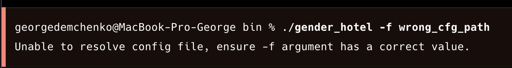
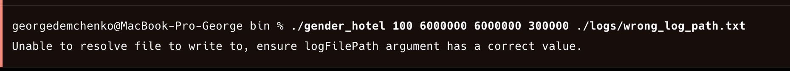

## Демченко Георгий Павлович, БПИ-235

## ИДЗ №4, Варинат №18

## Индивидуальное условие №18

* *Задача о гендерной гостинице (леди и джентльмены). В гостинице 10 номеров рассчитаны на одного человека и 15 номеров рассчитаны на двух человек. В гостиницу случайно приходят клиенты леди и клиенты джентльмены, и конечно они могут провести ночь в номере только с представителем своего пола. Если для клиента не находится подходящего номера, он уходит искать ночлег в другое место. Клиенты порождаются динамически и уничтожаются при освобождении номера или уходе из гостиницы при невозможности поселиться. Создать многопоточное приложение, моделирующее работу гостиницы. Каждого клиента и гостиницу (точнее ее администратора) моделировать отдельным потоком.*

## Условия задания

* *Программа должна быть разработана на языке программирования C или C++ с использованием для работы с потоками функций POSIX Thread. Использование более высокоуровневых библиотек классов и функций не допускается.*

## Подробное описание ролевого сценария работы программы

*В гостинице 10 номеров рассчитаны на одного человека и 15 номеров рассчитаны на двух человек. В гостиницу с некоторым промежутком по времени случайно приходят клиенты леди и клиенты джентльмены , и конечно они могут провести ночь в номере только с представителем своего пола. Для каждого нового посетителя администратор отеля пытается подобрать номер, который удволетворял бы требованиям клиента. Одиночные номера считаются более престижными по сравнению с двуместными номерами, поэтому администратор отеля сначала пытается найти свободный одноместный номер для заселения нового клиента, если свободных одноместных номеров не оказалось, то администратор ищет свободные двуместные номера по следующему приницпу: сначала ищем номера, в которых уже заселен один клиент с таким же полом как и у нового посетителя и заселяем его туда, если таких номеров не оказалось, выделяем посетителю новый-пустой двуместный номер и заселяем его туда. Посетители могут свободно заселяться и выселяться из двуместных номеров, не дожидаясь пока к ним подселят клиента того же пола. Если администратор не смог найти свободный для заселения номер, то клиент перестает пытаться получить номер в отеле и уходит. Когда клиент получает в свое распоряжение номер, то он проводит в нем указанное администратором для каждого типа номеров (одиночный, двойной) время, занимая его, после чего администратор выселяет его из отеля, освобождая номер.*

## Модель параллельных вычислений

**Используется модель "Клиенты и серверы"**

- **Потоки-посетители - клиенты**
- **Отель-администратор - сервер**

## Обобщенный алгоритм

- Главным потоком создается инстанс разделяемого потоками-посетителями объекта - Отеля
- Главным потоком с заданной через аргументы задержкой по времени иницилизуются потоки-посетители, им передается потоковая функция попытки получения номера в отеле и инстанс сущености посетитель с случайным полом (Мужской/Женский) и уникальным Id
- Каждый поток-посетитель в потоковой функции пытается получить номер в отеле, вызывая функцию администратора-отеляа на выделение номера
    - Сперва администратор пытается выделить потоку-посетителю одноместный номер (ведется учет свободных номеров и id свободных номеров)
    - Если такого номера нет, то администратор пытается подселить поток-посетителя в двуместный номер, где уже "расположен" пользователь-поток с таким же полом как и у нового потока (ведется учет количества свободных двуместных номеров - двуместный номер считается занятым когда в нем одноверменно распологаются два пользователя - потока, гендера посетителей в каждом двуместном номере, количества постеителей в каждом двуместном номере)
    - Если такого номера нет, то потоку-посетителю выделяется пустой двуместный номер(за номером закрепляется пол посетителей до времени его полного освобождения)
- Если потоку-посетителю не удалось получить номер, то он сразу же перестает пытаться его получить освобождается
- В случае получения потоком-посетителем номера, он пребывает там указанное для типа номера время (ождиает), при этом посетители в двойных номерах не ждут пока к ним "подселят" другого потока-посетителя во избежании дедлока программы в случае когда все посетители закончились а поток так и не получил "сожителя" в номер
- По окончанию времени пребывания (ожидания)потока-посетителя в номере, администратор выписыват посетителя из номера по следующим правилам:
    - Если поток-посетитель пребывал в одноместном номере, увеличиваем число свободных одноместных номеров и освбождаем id номера
    - Если поток-посетитель пребывал в двуместном номере и в нем ещё остаются посетители, то уменьшаем число потоков-посетителей в номере
    - Если поток-посетитель пребывал в двуместном номере и в нём больше нет посетителей, то уменьшаем число потоков-посетителей в номере, увеличиваем число свободных двуместных номеров, убираем закрепленный за номеров гендер.
- По оконачнии пребывания новых посетителей в отель (пораждения соответсвуюзщих потоков) и выписки последнего посетителя-потока из отеля администратором все потоки-посетители освобождаются главным потоком
- Инстанс разделяемого потоками объекта - Отеля освобождается главным потоком

## Документация | [main.cpp](https://github.com/AvtorPaka/CSA_RISC-V/tree/master/src/IndHW/PosixMultithreading/src/main.cpp)

### Сборка программы

```sh
cd PosixMultithreading
make
```

Бинарные файлы программы будут расположены в созданной папке **PosixMultithreading/bin**

## Входные данные программы / аргументы командной строки

### Вывод информационной помощи по запуску программы

```sh
./bin/gender_hotel -h
```

### Запуск программы с явной передачей аргументов

```bash
./bin/gender_hotel <guests_number> <single_room_stay_time> <double_room_stay_time> <new_guest_arrival_time> <log_file_path>
```

- **<guests_number>** - количество гостей (потоков), которые попытаются получить номер в отеле
- **<single_room_stay_time>** - время пребывания гостя в одноместном номере отеля в микросекундах (>= 300000 иначе 300000)
- **<double_room_stay_time>** - время пребывания гостя в двуместном номере отеля в микросекундах (>= 300000 иначе 300000)
- **<new_guest_arrival_time>** - задержка между попытками каждого нового гостя (потока) получить номер в отеле в микросекундах (>= 20000 иначе 20000)
- **<log_file_path>** - путь к файлу для записи логов

### Запуск программы с использованием конфигурационного файла

```bash
./bin/gender_hotel -f <config_file_path>
```

- **<config_file_path>** - путь к конфигурационному файлу

### Структура конфигурационного файла

```txt
guestNumber=<guests_number>
singleRoomStayTime=<single_room_stay_time>
doubleRoomStayTime=<double_room_stay_time>
newGuestArrivalTime=<new_guest_arrival_time>
logFilePath=<log_file_path>
```

## Использование генераторов случайных чисел

Для каждого созданного потока-посетителя отеля генерируется случайное число - 0 или 1, определяющее пол посетителя. Если число 0 - посетитель мужчина, если число 1 - посетитель женщина.

## Примеры входных и выходных файлов (конфигурационные файлы и логи)

Примеры входных конфигурационных файлов с аргументами для работы программы приведены в папке [**configs**](https://github.com/AvtorPaka/CSA_RISC-V/tree/master/src/IndHW/PosixMultithreading/configs) и пронумерованы.

Сооветствующие им выходные файлы (логи) работы программы приведены в папке [**logs**](https://github.com/AvtorPaka/CSA_RISC-V/tree/master/src/IndHW/PosixMultithreading/logs)

## Примеры работы программы [main.cpp](https://github.com/AvtorPaka/CSA_RISC-V/tree/master/src/IndHW/PosixMultithreading/src/main.cpp)

**Видео-пример:**
- [Яндекс-диск](https://disk.yandex.ru/i/on6c23t70Y-Glg)

### Случай невалидного пути к файлу конфигурации



### Случай невалидного пути к файлу логирования

