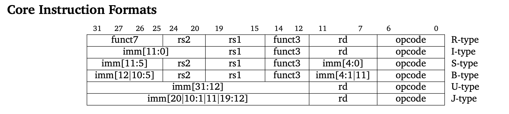
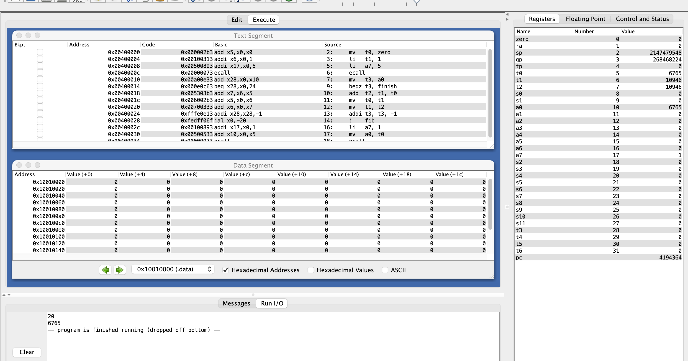

# АВС ДЗ №2

## Демченко Георгий Павлович, БПИ-235

### Форматы инструкций



### 1. fibonacci.s

```assembly
main:                   #Формат инструкции:
    mv   t0, zero       # Псевдокоманда, расскладывается в add : R-type 
    li   t1, 1          # Псевдокманда, расскалдывается в addi : I-type

    li   a7, 5          # Псевдокманда, расскалдывается в addi : I-type 
    ecall               # I-type
    mv   t3, a0         # Псевдокоманда, расскладывается в add : R-type  
fib:
    beqz t3, finish     # Псевдокоманда, расскладыватся в beq : B-type
    add  t2, t1, t0     # R-type
    mv   t0, t1         # Псевдокоманда, расскладывается в add : R-type 
    mv   t1, t2         # Псевдокоманда, расскладывается в add : R-type 
    addi t3, t3, -1     # I-type
    j    fib            # Псевдокоманда, расскладывается в jal : J-type
finish:
    li   a7, 1          # Псевдокманда, расскалдывается в addi : I-type
    mv   a0, t0         # Псевдокоманда, расскладывается в add : R-type 
    ecall               # I-type

```

### Результат работы программы для числа 20:



### Результат ассемблирования (дамп)

```assembly
                    # Форматы инструкций
add x5 x0 x0        #  R-type 
addi x6 x0 1        #  I-type
addi x17 x0 5       #  I-type
ecall               #  I-type
add x28 x10 x0      #  R-type
beq x28 x0 24       #  B-type
add x7 x6 x5        #  R-type
add x5 x6 x0        #  R-type
add x6 x7 x0        #  R-type
addi x28 x28 -1     #  I-type
jal x0 -20          #  J-type
addi x17 x0 1       #  I-type
add x10 x5 x0       #  R-type
ecall               #  I-type
```