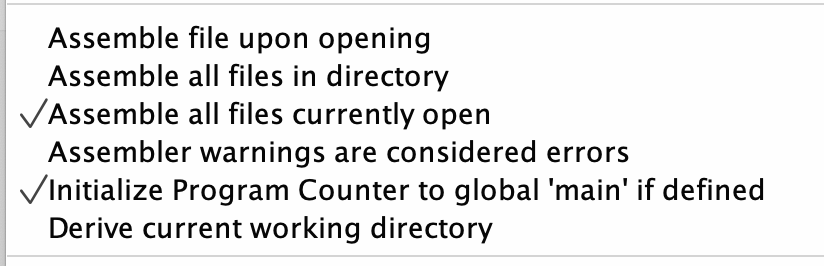

# АВС ДЗ №7

## Демченко Георгий Павлович, БПИ-235

## Documentation | [strncpy.s](https://github.com/AvtorPaka/CSA_RISC-V/tree/master/src/Homework/Hw_6/strncpy.s)

### 0. Program goal

### Main

* Develop a subroutine that outputs a digit transmitted via register a0 to the digital block indicator. The address (left or right) of the indicator is specified in register a1. If the number in register a0 exceeds a hexadecimal digit, then only the lower 4 digits are taken into account and an additional period is output.

* To demonstrate, write a program that calls this subroutine, which in a cycle with a delay (system call sleep), every second outputs the next value in a cycle first to one, and then to the other indicator.

### Optional

* Modify the keyboard program so that when the corresponding key is pressed, it displays only the pressed digit in the right indicator on the digital indicator. If there is no pressed key, only a dot is displayed on the digital indicator.

### Local launch in RARS

**Since all the assembler files necessary to run the main and test programs are located in one directory, you should use the following execution settings in the RARS environment**

