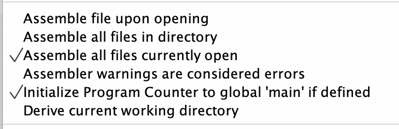

## Демченко Георгий Павлович, БПИ-235

## ИДЗ №2, Варинат №4

## Условия задания

* Разработать программы на языке Ассемблера процесса RISC-V, с использованием команд арифметического сопроцессора, выполняемые в симуляторе RARS. Разработанные программы должны принимать числа в допустимом диапазоне. Например, нужно учитывать области определения и допустимых значений, если это связано с условием задачи.

* При разработке программы использовать числа с плавающей
точкой двойной точности (double).

## Индивидуальное условие №4

* Разработать программу, вычисляющую с помощью степенного ряда с точностью не хуже $0,1 \%$ значение биномиальной функции $(1 + x)^{m}$ для конкретных параметров $m$ и $x$

* $m \in \mathbb{N}, \space x \in \mathbb{R}$

## Метод решения задачи

* [Бином Ньютона](https://ru.wikipedia.org/wiki/%D0%91%D0%B8%D0%BD%D0%BE%D0%BC_%D0%9D%D1%8C%D1%8E%D1%82%D0%BE%D0%BD%D0%B0) / [Биномиальный ряд](https://ru.wikipedia.org/wiki/%D0%91%D0%B8%D0%BD%D0%BE%D0%BC%D0%B8%D0%B0%D0%BB%D1%8C%D0%BD%D1%8B%D0%B9_%D1%80%D1%8F%D0%B4)

$\Rightarrow (1 + x)^{m} = \sum_{k = 0}^{m}C_{n}^{k} \cdot x^{k}$ (частичная сумма степенного ряда)

## Локальный запуск в среде RARS

**Так как все необходимые для запуска основной и тестировочной программы ассемблерные файлы расположены в одной директории, то следует использовать следующие настройки исполнения в среде RARS**

**В разделе документации каждой основной программы указано, какие файлы необходимо открыть для успешного исполнения.**

## Документация | [macrolib.s](https://github.com/AvtorPaka/CSA_RISC-V/tree/master/src/IndHW/BinomialSeries/macrolib.s)

|  **Макрос** | **Назначение**  |  **Передаваемые параметры** | **Возвращаемое значение** 
| ---------- | -------------- |  ------------ | ------------ |

## Документация | [calculate_binomial_series.s](https://github.com/AvtorPaka/CSA_RISC-V/tree/master/src/IndHW/BinomialSeries/calculate_binomial_series.s)

|  **Подпрограмма** | **Назначение**  |  **Передаваемые параметры** | **Возвращаемое значение** 
| ---------- | -------------- |  ------------ | ------------ |

## Документация | [main_binomial_series.s](https://github.com/AvtorPaka/CSA_RISC-V/tree/master/src/IndHW/BinomialSeries/main_binomial_series.s)

### 0. Подключаемые макросы / ассемблерные файлы

- **macrolib.s**
- **calculate_binomial_series.s**

### 1. Использование подпрограмм

- **Из подключаемых ассемблерных файлов**
    - **calculate_binomial_series.s** -> **asdsad**

- **Собственные**
    - **нет**

### 2. Использование макросов

- **Из подключаемых ассемблерных файлов**
    - **macrolib.s** ->
        -  **adasd**

- **Собственные**
    - **Нет**

## Документация | [test_binomial_series.s](https://github.com/AvtorPaka/CSA_RISC-V/tree/master/src/IndHW/BinomialSeries/test_binomial_series.s)

### 0. Подключаемые макросы / ассемблерные файлы

- **macrolib.s**
- **calculate_binomial_series.s**

### 1. Использование подпрограмм

- **Из подключаемых ассемблерных файлов**
    - **calculate_binomial_series.s** -> **asdsad**

- **Собственные**
    - **нет**

### 2. Использование макросов

- **Из подключаемых ассемблерных файлов**
    - **macrolib.s** ->
        -  **adasd**

- **Собственные**
    - **Нет**

## Примеры работы программы | [main_binomial_series.s](https://github.com/AvtorPaka/CSA_RISC-V/tree/master/src/IndHW/BinomialSeries/main_binomial_series.s) (ручные тесты)

## Результат работы программы | [test_non_decreasing_sequence.s](https://github.com/AvtorPaka/CSA_RISC-V/tree/master/src/IndHW/BinomialSeries/test_binomial_series.s) (автотесты)

## Результат работы программы | [AutoTests.cpp](https://github.com/AvtorPaka/CSA_RISC-V/tree/master/src/IndHW/BinomialSeries/AutoTests.cpp) (проверка корркетности вычислений)