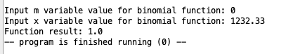

## Демченко Георгий Павлович, БПИ-235

## ИДЗ №2, Варинат №4

## Условия задания

* Разработать программы на языке Ассемблера процесса RISC-V, с использованием команд арифметического сопроцессора, выполняемые в симуляторе RARS. Разработанные программы должны принимать числа в допустимом диапазоне. Например, нужно учитывать области определения и допустимых значений, если это связано с условием задачи.

* При разработке программы использовать числа с плавающей
точкой двойной точности (double).

## Индивидуальное условие №4

* Разработать программу, вычисляющую с помощью степенного ряда с точностью не хуже $0,1 \%$ значение биномиальной функции $(1 + x)^{m}$ для конкретных параметров $m$ и $x$

* $m \in \mathbb{N}, \space x \in \mathbb{R}$

## Метод решения задачи

* [Бином Ньютона](https://ru.wikipedia.org/wiki/%D0%91%D0%B8%D0%BD%D0%BE%D0%BC_%D0%9D%D1%8C%D1%8E%D1%82%D0%BE%D0%BD%D0%B0) / [Биномиальный ряд](https://ru.wikipedia.org/wiki/%D0%91%D0%B8%D0%BD%D0%BE%D0%BC%D0%B8%D0%B0%D0%BB%D1%8C%D0%BD%D1%8B%D0%B9_%D1%80%D1%8F%D0%B4)

$\Rightarrow (1 + x)^{m} = \sum_{k = 0}^{m}C_{m}^{k} \cdot x^{k}$ (частичная сумма степенного ряда)

## Локальный запуск в среде RARS

**Так как все необходимые для запуска основной и тестировочной программы ассемблерные файлы расположены в одной директории, то следует использовать следующие настройки исполнения в среде RARS**

**В разделе документации каждой основной программы указано, какие файлы необходимо открыть для успешного исполнения.**

## Документация | [macrolib.s](https://github.com/AvtorPaka/CSA_RISC-V/tree/master/src/IndHW/BinomialSeries/macrolib.s)

|  **Макрос** | **Назначение**  |  **Передаваемые параметры** | **Возвращаемое значение** 
| ---------- | -------------- |  ------------ | ------------ |
| **calculate_binomial_coef**  | Подсчёта биномиального коефицента - $C_{n}^{k}$ |  **%n** - n параметр биномиального коефицента   **%k** - k параметр биномиального коефицента   **%fr** - fp регистр, куда будет записано посчитанное значение |  **%fr** - fp регистр, куда будет записано посчитанное значение |
| **pow**  |  Подсчет степени (натуральной) дробного числа двойной точности | **%fbase** - число для возведения в степень   **%exp** - показатель степени числа   **%fr** - fp регистр, куда будет записано значение степени  | **%fr** - fp регистр, куда будет записано значение степени  |
| **calculate_factotial**  | Подсчет 64-битного факториала натурального числа | **%num** - параметр факториала   **%fr** - fp регистр, куда будет записано значение факториала  | **%fr** - fp регистр, куда будет записано значение факториала |
| **input_function_parameters**  | Ввод аргументов биномиальной функции   Включает валидацию параметров, читайте описание макроса **validate_function_variables** | **%x** - fp регистр, куда будет записан x параметр при успешном вводе   **%m** - регистр, куда будет записанн m параметр при успешном вводе  |  **%x** - fp регистр, куда будет записан x параметр при успешном вводе   **%m** - регистр, куда будет записанн m параметр при успешном вводе  |
| **validate_function_variables**  |  Валидация входных параметров   В случае недопустимых входных параметров (m < 0) программа завершается с ошибкой валидации   В случае (m = 0, x = -1.00) программа завершается с undefined_function_value   В случае (m = 0, x != -1.00) программа завершается с результатом функции 1.00   В случае (m != 0, x = -1.00) програма завершается с результатом функции 0.00   В ином случае ход программы продолжается | **%x** - параметр x биномиальной функции   **%m** - параметр m биномиальной функции |  **Нет** |
| **print_function_result**  | Вывод результатов работы биномиальной функции функции  | **%fnum** - десятичное число двойной точности, резултат функции  | **Нет**  |
| **create_double_value**  |  Создание дробного числа двоичной точности(double) из целого числа | **%fr** - fp регистр, куда будет записано число   **%num** - число, которое нужно преобразовать и записать  | **%fr** - fp регистр, куда будет записано число |
| **print_double_value**  | Вывод дробного числа двоичной точности в консоль | **%fr** - fp регистр, значение которого будет выведено в консоль |  **Нет** |
| **print_string**  |  Вывод строки в консоль | **%str** - лейбл с строкой, значение которой будет выведено в консоль | **Нет**  |
| **throw_m_variable_validation_error**  | Выброс исключения валидации параметра m функции и завершения программы |  **Нет** | **Нет**  |
| **print_char**  | Вывод символа в консоль  | **%x** - символ для вывода в консоль  | **Нет**  |
| **newline**  | Вывод символа переноса строки в консоль  |  **Нет** |  **Нет** |
| **exit_program**  |  Завершение работы программы | **Нет**  |  **Нет** |
| **stack_push_d**  | Cохраенение 64-битного машинного слова на стек  | **%fx** - fp регистр, значение которого сохранится на стек  |  **Нет** |
| **stack_pop_d**  | Снятие 64-битного машинного  слова со стека   |  **%fx** - fp регистр, в который будет записано значение со стека  | **%fx** - fp регистр, в который будет записано значение со стека  |
| **stack_push_w**  | Cохраенение 32-битного машинного  слова на стек  | **%x** - регистр, значение которого сохранится на стек  |  **Нет** |
| **stack_pop_w**  | Снятие 32-битного машинного  слова со стека  |  **%x** - регистр, в который будет записано значение со стека | **%x** - регистр, в который будет записано значение со стека  |
| **generate_test_data**  |   |   |   |

## Документация | [calculate_binomial_series.s](https://github.com/AvtorPaka/CSA_RISC-V/tree/master/src/IndHW/BinomialSeries/calculate_binomial_series.s)

### 0. Подключаемые макросы / ассемблерные файлы

- **macrolib.s**

### 1. Использование макросов

- **Из подключаемых ассемблерных файлов**
    - **macrolib.s** ->
        -  **stack_push_w**
        - **stack_pop_w**
        - **stack_push_d**
        - **stack_pop_d**
        - **create_double_value**
        - **calculate_binomial_coef**
        - **pow**
        
- **Собственные**
    - **Нет**

|  **Подпрограмма** | **Назначение**  |  **Передаваемые параметры** | **Возвращаемое значение** 
| ---------- | -------------- |  ------------ | ------------ |
| **calculate_series**  |  Подсчет значения биномиальной функции с помощью степенного ряда (Бинома Ньютона / Биномиального ряда)  | **a1** - степень биномиальной функции m   **fa1** - параметр биномиальной функции x | **fa0** - посчитанное значение биномиальной функции $f(x, m) = (1 + x)^{m}$ |

## Документация | [main_binomial_series.s](https://github.com/AvtorPaka/CSA_RISC-V/tree/master/src/IndHW/BinomialSeries/main_binomial_series.s)

### 0. Подключаемые макросы / ассемблерные файлы

- **macrolib.s**
- **calculate_binomial_series.s**

### 1. Использование подпрограмм

- **Из подключаемых ассемблерных файлов**
    - **calculate_binomial_series.s** -> **calculate_series**

- **Собственные**
    - **нет**

### 2. Использование макросов

- **Из подключаемых ассемблерных файлов**
    - **macrolib.s** ->
        -  **input_function_parameters**
        - **print_function_result**

- **Собственные**
    - **Нет**

## Документация | [test_binomial_series.s](https://github.com/AvtorPaka/CSA_RISC-V/tree/master/src/IndHW/BinomialSeries/test_binomial_series.s)

### 0. Подключаемые макросы / ассемблерные файлы

- **macrolib.s**
- **calculate_binomial_series.s**

### 1. Использование подпрограмм

- **Из подключаемых ассемблерных файлов**
    - **calculate_binomial_series.s** -> **calculate_series**

- **Собственные**
    - **нет**

### 2. Использование макросов

- **Из подключаемых ассемблерных файлов**
    - **macrolib.s** ->
        - **generate_test_data**
        - **print_double_value**
        - **print_string**
        -  **print_function_result**

- **Собственные**
    - **Нет**

## Примеры работы программы | [main_binomial_series.s](https://github.com/AvtorPaka/CSA_RISC-V/tree/master/src/IndHW/BinomialSeries/main_binomial_series.s) (ручные тесты)

### Случай невалидных входных параметров

### Случаи крайних входных параметров, описанных в **validate_function_variables**

|   |   |   |
|  --------------  |  -------------- | -------------- |
|  |   |   |

### Случаи обычной работы

* **Погрешность точности $\approx 0.00001\%$**

|   |   |
|  --------------  |  -------------- |
|   |   |
|   |   |
|   |   |

## Результат работы программы | [test_non_decreasing_sequence.s](https://github.com/AvtorPaka/CSA_RISC-V/tree/master/src/IndHW/BinomialSeries/test_binomial_series.s) (автотесты)

## Результат работы программы | [TestsCheck.cpp](https://github.com/AvtorPaka/CSA_RISC-V/tree/master/src/IndHW/BinomialSeries/TestsCheck.cpp) (проверка корркетности вычислений)