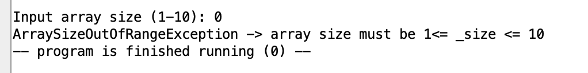
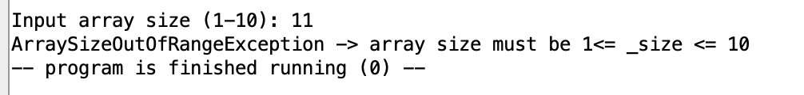
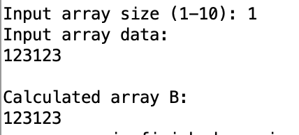
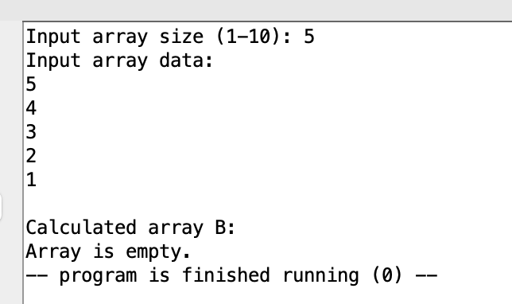
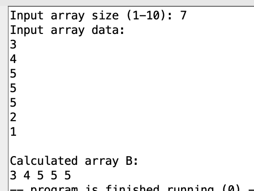
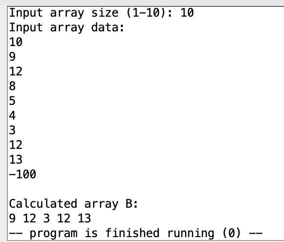
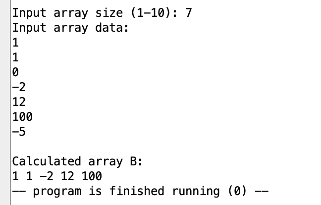
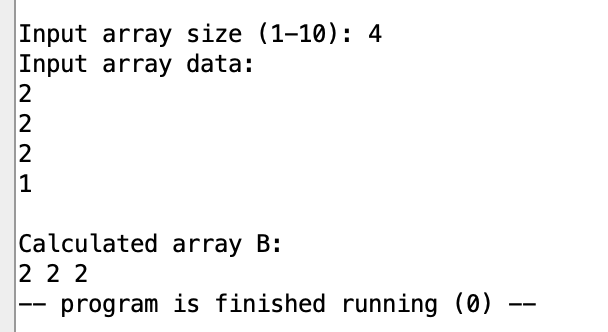

## Демченко Георгий Павлович, БПИ-235

## ИДЗ №1, Варинат №28

## Условия задания

* Разработать программу, которая вводит одномерный массив A, состоящий из N элементов (значение N вводится при выполненпии программы),после чего формирует из элементов массива A новый массив
B по правилам, указанным в варианте, и выводит его. Память под массивы может выделяться статически, на стеке, автоматичеси по выбору
разработчика с учетом требований к оценке работы.

* При решении задачи необходимо использовать подпрограммы для реализации ввода, вывода и формирования нового массива массива. Допустимы (при необходимости) дополнительные подпрограммы.

* Максимальное количество элементов в массиве не должно превышать
10 (ограничение обуславливается вводом данных с клавиатуры). При
этом необходимо обрабатывать некорректные значения как для нижней,
так и для верхней границ массивов в зависимости от условия задачи.

### Индивидуальное условие (№28)

* Сформировать массив B из элементов массива A, которые образуют неубывающую последовательность. Неубывающей последовательностью считать элементы идущие подряд, которые равны между собой или каждый последующий больше предыдущего.

## Документация | [Библиотека макросов]

### 1. Макрос ввода данных | Подпрограммы и методы

|  **Подпрограмма** | **Назначение**  |  **Передаваемые параметры** | **Возвращаемое значение** 
| ---------- | -------------- |  ------------ | ------------ |

### 2. Макрос вывода данных массива | Подпрограммы и методы

|  **Подпрограмма** | **Назначение**  |  **Передаваемые параметры** | **Возвращаемое значение** 
| ---------- | -------------- |  ------------ | ------------ |

### 3. Макрос генерации тестовых данных | Подпрограммы и методы

|  **Подпрограмма** | **Назначение**  |  **Передаваемые параметры** | **Возвращаемое значение** 
| ---------- | -------------- |  ------------ | ------------ |

## Документация | [non_decreasing_sequence.s](https://github.com/AvtorPaka/CSA_RISC-V/tree/master/src/IndHW/NonDecreasingSequence/non_decreasing_sequence.s)

### 0. Подключаемые макросы / ассемблерные файлы

- **фывыв**
- **фывфв**
- **фвфывфыв**

### 1. Использование подпрограмм

- **Из подключаемых макросов**
    - sadasd
    - adasd
    - asdsd

- **Собственные**
    - фывфывы

|  **Подпрограмма** | **Назначение**  |  **Передаваемые параметры** | **Возвращаемое значение** 
| ---------- | -------------- |  ------------ | ------------ |
|  **input_array_data** | Ввод размера массива и его наполнение пользователем через консоль | **a1** - адресс массива в памяти, куда пользователь будет записывать данные |  **a0** -  размер заполненого массива (в случае допустимого значение)   Иначе вызов метода **throw_ArraySizeOutOfRangeException** |
|  **check_array_size** | Проверка введенного размера массива на корркетность |  **a0** - Размер массива, введенный пользователем   **a1** - нижняя граница размера массива (1)   **a2** - верхняя граница размера массива (10) | **a0** - 0 если размер недопустим, 1 в другом случае  |
|  **create_b_array** | **1.** Cоздание массива B ,состоящего из неубывающих последовательноcтей элементов из переданного массива A   **2.** В случае когда в массиве A 1 элемент - массив B состоит из этого элемента   **3.** В остальных случаях массив B будет состоять из неубывающих последовательностей в массиве A   **4.** Если в A отсутствуют неубывающие последовательности - массив B будет пустым  |  **a0** - адрес массива A   **a1** - размер массива A   **a2** - адрес массива B, куда будет вестить запись | **a0** - адресс созданного массива B   **a1** - размер полученного массива B  |
|  **func_output_array_data** | Вывод значений из массива в консоль (в частности полученного в результате работы программы массива B)  | **a0** - адрес массива, данные которого надо вывести   **a1** - размер массива  |  **a0** - адресс переданного  массива |

### 2. Использование методов

- **Из подключаемых макросов**
    - sadasd
    - adasd
    - asdsd

- **Собственные**
    - фывфывы

|  **Метод** | **Назначение**  |
|  ---------- | ----------  |
|  **throw_ArraySizeOutOfRangeException** | Выброс исключения и завершение работы программы |
| **exit_program**  |  Завершение работы программы |

## Документация | [test_non_decreasing_sequence.s](https://github.com/AvtorPaka/CSA_RISC-V/tree/master/src/IndHW/NonDecreasingSequence/test_non_decreasing_sequence.s)

### 0. Подключаемые макросы / ассемблерные файлы

- **фывыв**
- **фывфв**
- **фвфывфыв**

### 1. Использование подпрограмм

- **Из подключаемых макросов**
    - sadasd
    - adasd
    - asdsd

- **Собственные**
    - фывфывы

|  **Подпрограмма** | **Назначение**  |  **Передаваемые параметры** | **Возвращаемое значение** 
| ---------- | -------------- |  ------------ | ------------ |
|  **create_b_array** | **1.** Cоздание массива B ,состоящего из неубывающих последовательноcтей элементов из переданного массива A   **2.** В случае когда в массиве A 1 элемент - массив B состоит из этого элемента   **3.** В остальных случаях массив B будет состоять из неубывающих последовательностей в массиве A   **4.** Если в A отсутствуют неубывающие последовательности - массив B будет пустым  |  **a0** - адрес массива A   **a1** - размер массива A   **a2** - адрес массива B, куда будет вестить запись | **a0** - адресс созданного массива B   **a1** - размер полученного массива B  |
|  **func_output_array_data** | Вывод значений из массива в консоль (в частности полученного в результате работы программы массива B)  | **a0** - адрес массива, данные которого надо вывести   **a1** - размер массива  |  **a0** - адресс переданного  массива |

### 2. Использование методов

- **Из подключаемых макросов**
    - sadasd
    - adasd
    - asdsd

- **Собственные**
    - фывфывы

|  **Метод** | **Назначение**  |
|  ---------- | ----------  |
| **exit_program**  |  Завершение работы программы |

## Примеры работы программы | [non_decreasing_sequence.s](https://github.com/AvtorPaka/CSA_RISC-V/tree/master/src/IndHW/NonDecreasingSequence/non_decreasing_sequence.s) (ручные тесты)

### Случаи недопустимого размера 

|   |   |
|  --------------  |  -------------- |
|   |   |

### Случай одного элемента в массиве A

### Случай отсутствия неубывающих последовательностей в массиве A

### Случаи обычной работы

|   |   |
|  --------------  |  -------------- |
|   |   |
|   |   |

## Примеры работы программы | [test_non_decreasing_sequence.s](https://github.com/AvtorPaka/CSA_RISC-V/tree/master/src/IndHW/NonDecreasingSequence/test_non_decreasing_sequence.s) (автотесты)
