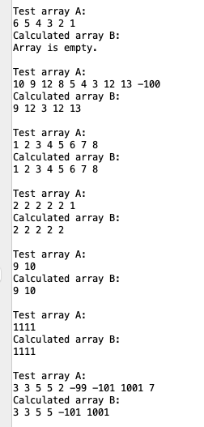

## Демченко Георгий Павлович, БПИ-235

## ИДЗ №1, Варинат №28

## Условия задания

* Разработать программу, которая вводит одномерный массив A, состоящий из N элементов (значение N вводится при выполненпии программы),после чего формирует из элементов массива A новый массив
B по правилам, указанным в варианте, и выводит его. Память под массивы может выделяться статически, на стеке, автоматичеси по выбору
разработчика с учетом требований к оценке работы.

* При решении задачи необходимо использовать подпрограммы для реализации ввода, вывода и формирования нового массива массива. Допустимы (при необходимости) дополнительные подпрограммы.

* Максимальное количество элементов в массиве не должно превышать
10 (ограничение обуславливается вводом данных с клавиатуры). При
этом необходимо обрабатывать некорректные значения как для нижней,
так и для верхней границ массивов в зависимости от условия задачи.

### Индивидуальное условие (№28)

* Сформировать массив B из элементов массива A, которые образуют неубывающую последовательность. Неубывающей последовательностью считать элементы идущие подряд, которые равны между собой или каждый последующий больше предыдущего.

## Локальный запуск в среде RARS

**Так как все необходимые для запуска основной и тестировочной программы ассемблерные файлы расположены в одной директории, то следует использовать следующие настройки исполнения в среде RARS**

**В разделе документации каждой основной программы указано, какие файлы необходимы открыть для успешного исполнения.**

## Документация | [macrolib.s](https://github.com/AvtorPaka/CSA_RISC-V/tree/master/src/IndHW/NonDecreasingSequence/macrolib.s)

|  **Макрос** | **Назначение**  |  **Передаваемые параметры** | **Возвращаемое значение** 
| ---------- | -------------- |  ------------ | ------------ |
|  **input_array_data** | Ввод размера массива и его наполнение пользователем через консоль | **%x** - адресс массива в памяти, куда пользователь будет записывать данные |  **a0** -  размер заполненого массива (в случае допустимого значение)   Иначе вызов макроса **throw_ArraySizeOutOfRangeException** |
|  **check_array_size** | Проверка введенного размера массива на корркетность |  **%x** - Размер массива, введенный пользователем   **%y** - нижняя граница размера массива (1)   **%z** - верхняя граница размера массива (10) | **a0** - 0 если размер недопустим, 1 в другом случае  |
|  **func_output_array_data** | Вывод значений из массива в консоль (в частности полученного в результате работы программы массива B)  | **%x** - адрес массива, данные которого надо вывести   **%y** - размер массива   **%z** - указатель на строку с сообщением вывода  |  **a0** - адресс переданного  массива |
|  **create_test_arrays** | Формирование набора тестовых массивов |  **%x** - указатель на массив, где будут хранится указатели на тестовые массивы   **%y** - указатель на массив, где будут хранится размеры тестовых массивов | **a0** - указатель на массив, заполненый указателями на тестовые массивы с данными   **a1** - указатель на массив, заполненый размерами тестовых массивов   **a2** - количество тестовых массивов (т.е размер массивов a0 и a1)  |
| **throw_ArraySizeOutOfRangeException**  | Выброс исключения и завершение работы программы в случае недопустимого размера массива  | **Нет**  |  **Нет** |
| **exitProgram**  | Завершение работы программы |  **Нет** |  **Нет** |
|  **newline** | Вывод символа переноса строки в консоль |  **Нет** |  **Нет** |
|  **next** | Вывод пробела в консоль |  **Нет** |  **Нет** |
| **print_char**  | Вывод символа в консоль | **%x** - символ для вывода в консоль  |  **Нет** |

## Документация | [create_array_b.s](https://github.com/AvtorPaka/CSA_RISC-V/tree/master/src/IndHW/NonDecreasingSequence/create_array_b.s)

|  **Подпрограмма** | **Назначение**  |  **Передаваемые параметры** | **Возвращаемое значение** 
| ---------- | -------------- |  ------------ | ------------ |
|  **create_b_array** | **1.** Cоздание массива B ,состоящего из неубывающих последовательноcтей элементов из переданного массива A   **2.** В случае когда в массиве A 1 элемент - массив B состоит из этого элемента   **3.** В остальных случаях массив B будет состоять из неубывающих последовательностей в массиве A   **4.** Если в A отсутствуют неубывающие последовательности - массив B будет пустым  |  **a0** - адрес массива A   **a1** - размер массива A   **a2** - адрес массива B, куда будет вестить запись | **a0** - адресс созданного массива B   **a1** - размер полученного массива B  |

## Документация | [non_decreasing_sequence.s](https://github.com/AvtorPaka/CSA_RISC-V/tree/master/src/IndHW/NonDecreasingSequence/non_decreasing_sequence.s)

### 0. Подключаемые макросы / ассемблерные файлы

- **macrolib.s**
- **create_array_b.s**

### 1. Использование подпрограмм

- **Из подключаемых ассемблерных файлов**
    - **create_array_b.s** -> **create_b_array**

- **Собственные**
    - **нет**

### 2. Использование макросов

- **Из подключаемых ассемблерных файлов**
    - **macrolib.s** ->
        -  **input_array_data**
        -  **check_array_size**
        -  **output_array_data**
        -  **exitProgram**
        -  **throw_ArraySizeOutOfRangeException**
        -  **newline**
        -  **next**
        -  **print_char**

- **Собственные**
    - **Нет**

## Документация | [test_non_decreasing_sequence.s](https://github.com/AvtorPaka/CSA_RISC-V/tree/master/src/IndHW/NonDecreasingSequence/test_non_decreasing_sequence.s)

### 0. Подключаемые макросы / ассемблерные файлы

- **macrolib.s**
- **create_array_b.s**

### 1. Использование подпрограмм

- **Из подключаемых ассемблерных файлов**
    - **create_array_b.s** -> **create_b_array**

- **Собственные**
    - **нет**

### 2. Использование макросов

- **Из подключаемых ассемблерных файлов**
    - **macrolib.s** ->
        - **create_test_arrays**
        -  **input_array_data**
        -  **check_array_size**
        -  **output_array_data**
        -  **exitProgram**
        -  **throw_ArraySizeOutOfRangeException**
        -  **newline**
        -  **next**
        -  **print_char**

- **Собственные**
    - **Нет**

## Примеры работы программы | [non_decreasing_sequence.s](https://github.com/AvtorPaka/CSA_RISC-V/tree/master/src/IndHW/NonDecreasingSequence/non_decreasing_sequence.s) (ручные тесты)

### Случаи недопустимого размера 

|   |   |
|  --------------  |  -------------- |
|   |   |

### Случай одного элемента в массиве A

### Случай отсутствия неубывающих последовательностей в массиве A

### Случаи обычной работы

|   |   |
|  --------------  |  -------------- |
|   |   |
|   |   |

## Результат работы программы | [test_non_decreasing_sequence.s](https://github.com/AvtorPaka/CSA_RISC-V/tree/master/src/IndHW/NonDecreasingSequence/test_non_decreasing_sequence.s) (автотесты)

