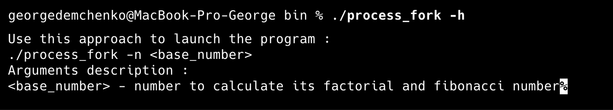
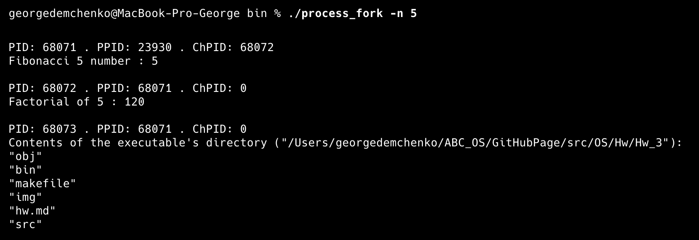
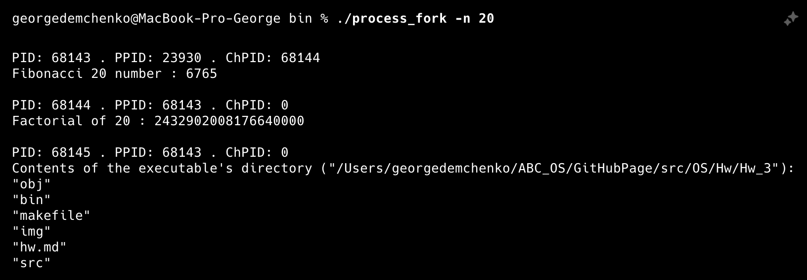
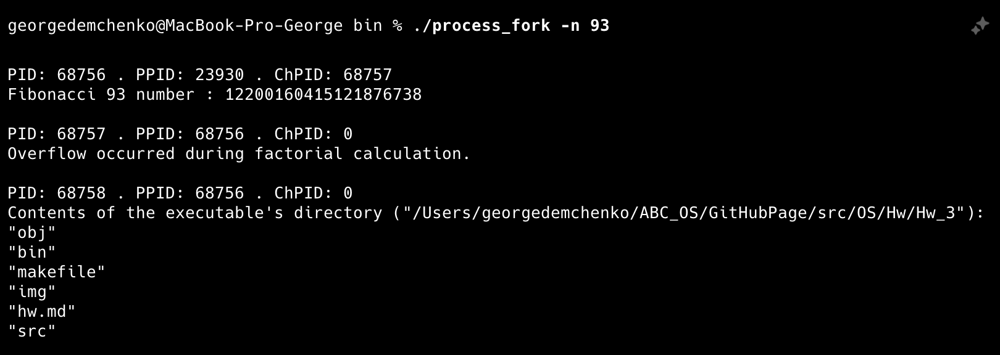
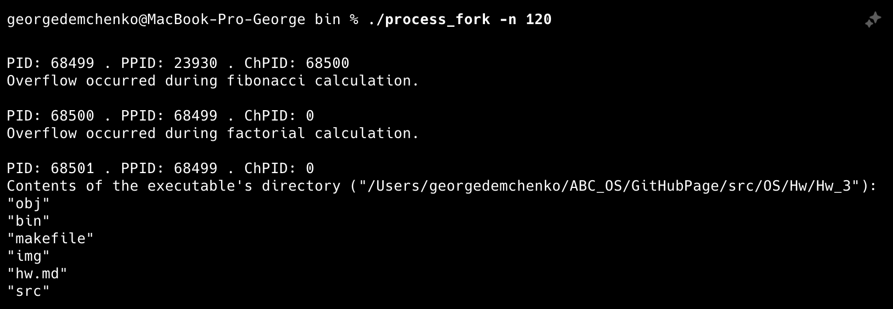
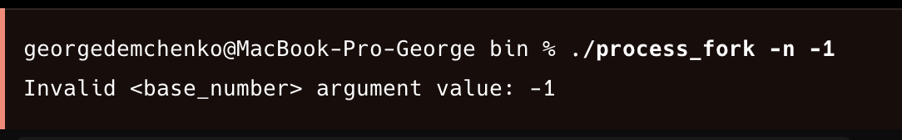

# OC ДЗ №3

### Демченко Георгий Павлович, БПИ-235

### Сборка программы

```sh
cd Hw_3
make
```

Бинарные файлы программы будут расположены в созданной папке **Hw_3/bin**

## Примеры работы программы











