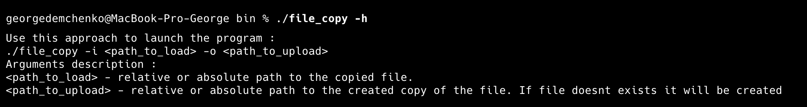

# OC ДЗ №4

### Демченко Георгий Павлович, БПИ-235

**Краткое описание :** Копирование содержимого файла системными вызовами с помощью скользящего окна (циклично с ограниченным буффером).

**Оценка, на которую реализован функционал:**  9

### Сборка программы

```sh
cd Hw_4
make
```
Бинарные файлы программы будут расположены в созданной папке **Hw_4/bin**

## Примеры работы программы




