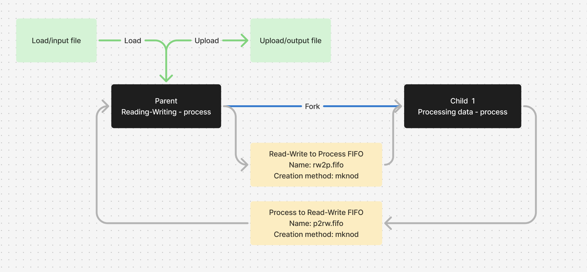

## Отчет на оценку 7

### Общая схема решаемой задачи



### Формат аргументов командной строки

```sh
./channel_ipc_7 -i <path_to_load> -o <path_to_upload>
```

| **Аргумент** |  **Назначение**  |  **Пример** |
| ---------  |  --------- | ---------  |
| **path_to_load**  | Относительный или абсолютный путь до файла с ASCII-строкой  |  ../../../test_data/test_1.txt  |
| **path_to_upload** | Относительный или абсолютный путь до файла, куда будет записан результат. Если файла не существует, он будет создан. |  ../tests_output/test_1.txt  |

### Сборка и запуск программы

```sh
cd Channel_IPC/src/grade_7/ && make
```

```sh
cd bin/
./channel_ipc_7 -i <path_to_load> -o <path_to_upload>
```

### Тестовые данные

Входные тестовые файлы представлены в директории **Channel_IPC/test_data**

Выходные данные тестов - результат для каждого тестового файла представлен в директории **Channel_IPC/src/grade_7/tests_output**