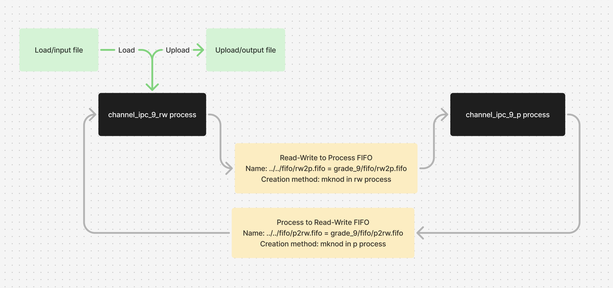

## Отчет на оценку 9

### Общая схема решаемой задачи



Обратите внимание на то, что с первого раза, из-за гонок процессов, обмен может не произойти, так как каналы создаются без согласования. Все начинает корректно работать, когда каналы уже существуют. Это можно сделать после прерывания зависшего процесса и повторного перезапуска.

Вывод результата в файл осуществляется процессом-писателем сразу (не по частям), в силу условий задачи.

### Формат аргументов командной строки

**Процесс чтения-записи в файл**

```sh
./channel_ipc_9_rw -i <path_to_load> -o <path_to_upload>
```

| **Аргумент** |  **Назначение**  |  **Пример** |
| ---------  |  --------- | ---------  |
| **path_to_load**  | Относительный или абсолютный путь до файла с ASCII-строкой  |  ../../test_data/test_1.txt  |
| **path_to_upload** | Относительный или абсолютный путь до файла, куда будет записан результат. Если файла не существует, он будет создан. |  ../../test_output/test_1.txt  |


**Процесс обработки строки**

```sh
/channel_ipc_9_p
```

Аргументы командной строки отсутствуют

### Сборка и запуск

**Процесс чтения-записи в файл**

```sh
cd Channel_IPC/src/grade_9/rw_process && make
```

```sh
cd bin/
./channel_ipc_9_rw -i <path_to_load> -o <path_to_upload>
```

**Процесс обработки строки**

```sh
cd Channel_IPC/src/grade_9/p_process && make
```

```sh
cd bin/
./channel_ipc_9_p
```

### Тестовые данные

Входные тестовые файлы представлены в директории **Channel_IPC/src/grade_9/test_data**

Выходные данные тестов - результат для каждого тестового файла представлен в директории **Channel_IPC/src/grade_9/tests_output**

