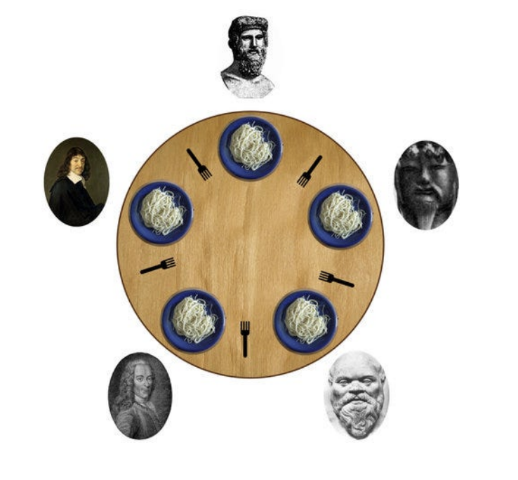

## Демченко Георгий Павлович, БПИ-235

## OC, ИДЗ №2, Вариант №8

Разработать программы, состоящие из нескольких взаимодействующих параллельных процессов. Количество разрабатываемых программ и их характеристики определяются в соответствии с требованиями выполнения на соответствующую оценку

## Индивидуальное условие №8

**Задача об обедающих философах.** Это классическая задача на взаимодействие параллельных процессов. Пять философов сидят возле круглого стола. Они проводят жизнь, чередуя приемы пищи и размышления. В центре стола находится большое блюдо спагетти. Спагетти длинные и запутанные, философам тяжело управляться с ними, поэтому каждый из них, что бы поесть, должен пользоваться двумя вилками. К несчастью, философам дали только **пять** вилок. Между каждой парой философов лежит одна вилка. Поэтому эти высококультурные и предельно вежливые люди договорились, что каждый будет пользоваться только теми вилками, которые лежат рядом с ним (слева и справа).

**Написать многопроцессную программу, моделирующую поведение философов с помощью семафоров.**

Программа должна избегать фатальной ситуации, в которой все философы голодны, но ни один из них не может взять обе вилки (например, каждый из философов держит по одной вилки и не хочет отдавать ее). Время, которое отводится на прием пищи и размышление задается случайно в некотором разумном для наблюдения из вне диапазоне.

**Решение должно быть симметричным, то есть все процессы– философы должны выполнять один и тот же код (являться равноправными процессами).**

## Описание сценария решаемой задачи

Каждый филосов представляет собой независимый (в реализациях на оценку 4-7 дочерний от главного-запускающего) процесс. Каждая вилка представляет собой двоичный мьютекс-семфор sem_fork_{$n$}. 

Каждому запускающемуся процессу-философу присваивается номер, исходя из количества запущенных процессов-философов - количества философов, допущенных за стол, и занятых за столом мест, значения которых хранятся в разделяемой памяти / очереди сообщений. Если количество $k$ философов за столом $\leq 4$, процесс-философ допускается за стол, ему присваивается номер исходя из первого незанятого за столом места, пронумерованных от 1 до 5, что можно определить по массиву булевых значений в разделяемой памяти / очереди сообщений, обозначающих занятость места, а значение количества допущенных философов в разделяемой памяти / очереди сообщений увеличивается на 1, иначе философ не садится за стол и уходит - завершается.

Каждый процесс-фиолософ с номером $n$ может захватить вилку-семафор с номером $(n - 1)$ и $(n) \% \space 5$, обозначая поднятия вилки для еды, в случае когда захвачены все 2 необходимых вилки, философ приступает к еде - ожидает некоторое случайное время в интервале $[0.5;1.5]$ секунд, после чего освобождает данные ему вилки-семафоры, начинаая с "левой" - с номером $n-1$. После освобождения всех вилок - принятия пищи, философ размышляет - ожидает некоторое время в  интервале $[0.5;1.5]$ секунд, после чего снова пытается поесть - захватить семафоры-вилки.

Во избежании ситуации дедлока, когда каждый из процессов-философов не может захватить оба семафора-вилки для принятия пищи, существует семафор-счетчик количества философов (официант), не пытающихся поесть, значение которого в любой момент времени не превышает 4, тогда в случае если захвачено 4 вилки , желающий философ не сможет захватить последную 5-ую вилку, образуя дедлок в определенных ситуациях, и будет ждать, покуда за столом не образуется как минимум 2 свободных вилки, т.е пока семафор-счетчик не станет больше 0, в таком случае всегда найдется процесс-философ, который сможет захватить 2 необходимых ему семафора-вилки и поесть.

По получению процессом-философом сигнала SIGINT (его завершении) он освобождает локальные ресурсы, уменьшает количество активных процессов-философов и освобождает стол в разделяемой памяти / очереди сообщений, и, в случае если процесс-философ является последним за столом (количество активных процессоф-философов = 0), удаляет семафоры и разделяемую память / очередь сообщений из системы.

### Индивидуальные отчеты по каждой из оценок находятся в соответствующих директориях