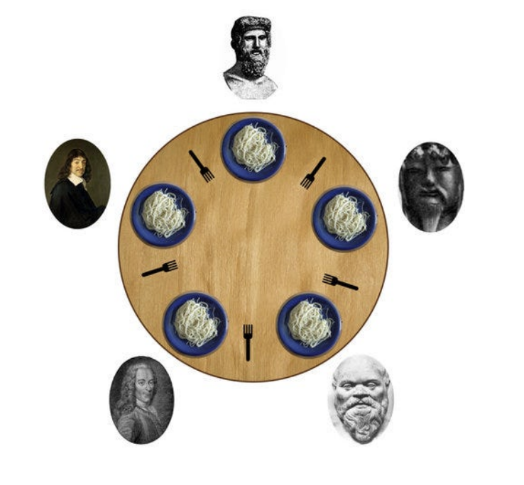
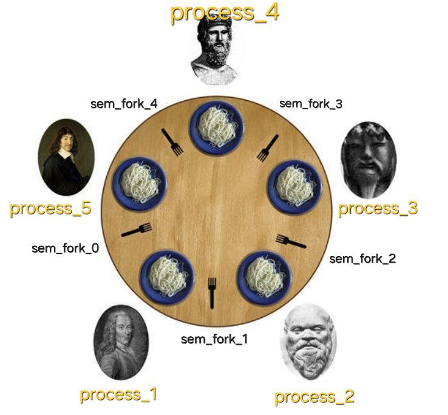

## Демченко Георгий Павлович, БПИ-235

## OC, ИДЗ №3, Вариант №8

**Цели и задачи:** Изучить работу с транспортным протоколом TCP. Научиться разбивать задачу на части, для последующего их выполнения серверами и клиентами.

Архитектура «клиент–сервер» широко используется при решении разнообразных прикладных задач. Существуют различные подходы к организации таких приложений с использованием для организации серверов и клиентов как процессов, так и потоков.

В ходе выполнения задания необходим разделить функции, выполняемые отдельными компонентами и организовать их взаи-
модействие,необходимое длявыполнения заданной прикладной задачи.

## Индивидуальное условие №8

**Задача об обедающих философах.** Это классическая задача на взаимодействие параллельных процессов. Пять философов сидят возле круглого стола. Они проводят жизнь, чередуя приемы пищи и размышления. В центре стола находится большое блюдо спагетти. Спагетти длинные и запутанные, философам тяжело управляться с ними, поэтому каждый из них, что бы поесть, должен пользоваться двумя вилками. К несчастью, философам дали только **пять** вилок. Между каждой парой философов лежит одна вилка. Поэтому эти высококультурные и предельно вежливые люди договорились, что каждый будет пользоваться только теми вилками, которые лежат рядом с ним (слева и справа).

**Написать клиент–серверную программу, моделирующую поведение философов с помощью семафоров.**

*Философы являются отдельными клиентами, синхронизируемыми посредством сервера, который фиксирует состояние стола и организует взаимодействие с философами.*

Программа должна избегать фатальной ситуации, в которой все философы голодны, но ни один из них не может взять обе вилки (например, каждый из философов держит по одной вилки и не хочет отдавать ее). Время, которое отводится на прием пищи и размышление задается случайно в некотором разумном для наблюдения из вне диапазоне.

**Решение должно быть симметричным, то есть все процессы–философы должны выполнять один и тот же код (являться равноправными процессами).**

## Описание сценария решаемой задачи

**1. Отображение сущностей:**

*   **Философ**: Каждый философ представляет собой **независимый клиентский процесс**. Клиент запускается как отдельная программа и подключается к серверу по сети.

*   **Стол и Вилки**: "Стол" со всеми его атрибутами (места, вилки, правила доступа) инкапсулирован внутри **серверного процесса** .
    *   **Вилки**: На сервере каждая из пяти вилок представлена **именованным POSIX семафором** (например, `/philosopher_fork_sem_N`), инициализированным как бинарный семафор. Эти семафоры управляются исключительно сервером. Клиенты не имеют к ним прямого доступа.
    *   **Места за столом**: Сервер отслеживает занятость `NUM_PHILOSOPHERS` (5) мест. Каждому успешно подключившемуся клиенту-философу сервер назначает уникальный номер (ID от 1 до 5).

*   **Официант**: Механизм официанта, ограничивающий одновременное количество едящих философов до `NUM_PHILOSOPHERS - 1` (т.е. до 4), реализован на сервере с помощью **именованного POSIX семафора-счетчика** `/philosopher_waiter_sem`, инициализированного значением 4.

**2. Взаимодействие и поведение:**

*   **Запуск и подключение клиента-философа**:
    *   Клиентский процесс запускается с указанием IP-адреса и порта сервера.
    *   Клиент устанавливает TCP-соединение с сервером.
    *   После успешного соединения клиент отправляет серверу сообщение `JOIN`.
    *   **Серверный процесс** обрабатывает запрос `JOIN`:
        *   Сервер проверяет, есть ли свободные места за "столом" (т.е. `active_philosophers_count < NUM_PHILOSOPHERS`).
        *   Если место есть, сервер назначает клиенту уникальный ID (от 1 до 5, соответствующий первому свободному), отмечает это место как занятое, увеличивает счетчик `active_philosophers_count` и отправляет клиенту сообщение `ID <id>`. Для каждого принятого клиента сервер создает **отдельный поток** для обработки его запросов.
        *   Если мест нет, сервер отправляет клиенту сообщение `FULL`, и клиентский процесс завершает свою работу.

*   **Жизненый цикл клиента-философа**:

    *   **Размышления**: Клиент-философ локально имитирует размышления, ожидая случайное время в интервале \[0.5; 1.5] секунд 

    *   **Попытка поесть (захват вилок)**:
        1.  После размышлений клиент-философ отправляет серверу сообщение `ACQUIRE <id>`.
        2.  **Поток на сервере**, обслуживающий данного клиента, получает это сообщение и выполняет следующую логику синхронизации:
            *   Пытается захватить "официанта": `/philosopher_waiter_sem`.
            *   Пытается захватить левую вилку:  `/philosopher_fork_sem_LEFT_IDX` (индекс левой вилки: `(id-1)`).
            *   Пытается захватить правую вилку: `/philosopher_fork_sem_RIGHT_IDX` (индекс правой вилки: `id % NUM_PHILOSOPHERS`).
        3.  После успешного захвата обеих вилок и "официанта", серверный поток отправляет клиенту сообщение `GRANTED`.
        4.  Клиент, получив `GRANTED`, переходит к приму пищи.

    *   **Прием пищи**: Клиент-философ локально имитирует прием пищи, ожидая случайное время в интервале \[0.5; 1.5] секунд

    *   **Освобождение вилок**:
        1.  После еды клиент-философ отправляет серверу сообщение `RELEASE <id>`.
        2.  **Поток на сервере**, обслуживающий клиента, получает это сообщение и выполняет:
            *   Освобождает левую вилку: `/philosopher_fork_sem_${LEFT_IDX}`.
            *   Освобождает правую вилку: `/philosopher_fork_sem_${RIGHT_IDX}`.
            *   Освобождает "официанта": `/philosopher_waiter_sem`.
        3.  Серверный поток отправляет клиенту сообщение `OK`.
        4.  Клиент, получив `OK`, возвращается к размышлениям.

*   **Завершение работы клиента-философа**:
    *   **По сигналу (SIGINT/SIGTERM) или получении `MSG_SERVER_DOWN` от сервера**:
        1.  Обработчик сигнала устанавливает флаг `client_shutdown_flag`.
        2.  Основной цикл клиента, обнаружив флаг, инициирует процедуру завершения.
        3.  Если клиент в этот момент держал вилки (т.е. получил `GRANTED` и еще не отправил `RELEASE`), он сначала отправит `RELEASE <id>` серверу.
        4.  Затем клиент отправляет серверу сообщение `LEAVE <id>`.
        5.  Серверный поток, получив `LEAVE`, освобождает ресурсы, помечает место как свободное, уменьшает `active_philosophers_count` и отправляет клиенту `RSP_BYE`.
        6.  Клиент закрывает TCP-соединение и завершает работу.

*   **Завершение работы сервера**:
    *   При получении сигнала SIGINT/SIGTERM серверный процесс устанавливает флаг `server_shutdown_flag` и закрывает свой слушающий TCP-сокет.
    *   Главный поток сервера рассылает всем активным клиентам сообщение `MSG_SERVER_DOWN`.
    *   Затем главный поток сервера для каждого активного потока-обработчика клиента выполняет `shutdown()` на сокете этого клиента и `pthread_join()`.
    *   Каждый поток-обработчик клиента, обнаружив `server_shutdown_flag`, освобождает все удерживаемые им семафоры и завершается.
    *   После того как все потоки-обработчики клиентов завершились, главный поток сервера вызывает `sem_close()` и `sem_unlink()` для всех созданных им именованных POSIX семафор и завершает работу.

### Индивидуальные отчеты по каждой из оценок находятся в соответствующих директориях