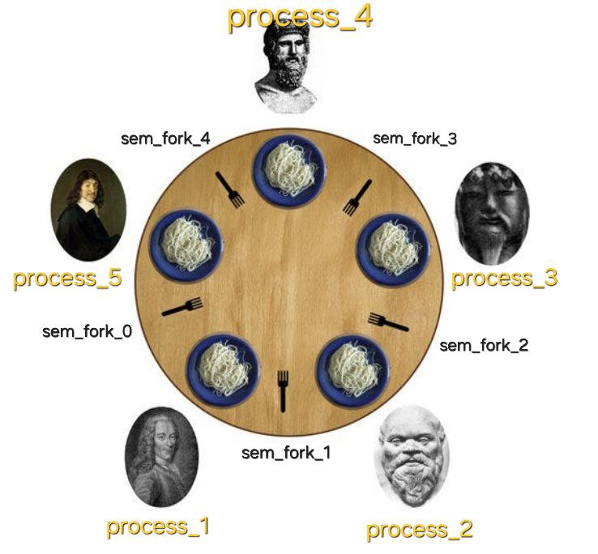

## OC, ИДЗ №4, Вариант №8

**Демченко Георгий Павлович, БПИ-235**

**Цели и задачи:** Изучить работу с транспортным протоколом UDP. Научиться разбивать задачу на части, для последующего их выполнения серверами и клиентами.

Архитектура «клиент–сервер» широко используется при решении разнообразных прикладных задач. Существуют различные подходы к организации таких приложений с использованием для организации серверов и клиентов как процессов, так и потоков.

В ходе выполнения задания необходим разделить функции, выполняемые отдельными компонентами и организовать их взаимодействие,необходимое длявыполнения заданной прикладной задачи.

## Индивидуальное условие №8

**Задача об обедающих философах.** Это классическая задача на взаимодействие параллельных процессов. Пять философов сидят возле круглого стола. Они проводят жизнь, чередуя приемы пищи и размышления. В центре стола находится большое блюдо спагетти. Спагетти длинные и запутанные, философам тяжело управляться с ними, поэтому каждый из них, что бы поесть, должен пользоваться двумя вилками. К несчастью, философам дали только **пять** вилок. Между каждой парой философов лежит одна вилка. Поэтому эти высококультурные и предельно вежливые люди договорились, что каждый будет пользоваться только теми вилками, которые лежат рядом с ним (слева и справа).

**Написать клиент–серверную программу, моделирующую поведение философов с помощью семафоров.**

*Философы являются отдельными клиентами, синхронизируемыми посредством сервера, который фиксирует состояние стола и организует взаимодействие с философами.*

Программа должна избегать фатальной ситуации, в которой все философы голодны, но ни один из них не может взять обе вилки (например, каждый из философов держит по одной вилки и не хочет отдавать ее). Время, которое отводится на прием пищи и размышление задается случайно в некотором разумном для наблюдения из вне диапазоне.

**Решение должно быть симметричным, то есть все процессы–философы должны выполнять один и тот же код (являться равноправными процессами).**

## Описание сценария решаемой задачи

**1. Отображение сущностей:**

*   **Философ**: Каждый философ представляет собой **независимый клиентский процесс**. Клиент запускается как отдельная программа и взаимодействует с сервером по сети **используя UDP**.

*   **Стол и Вилки**: "Стол" со всеми его атрибутами (места, вилки, правила доступа) инкапсулирован внутри **серверного процесса**.
    *   **Вилки**: На сервере каждая из пяти вилок представлена **именованным POSIX семафором** `/philosopher_fork_sem_N`, инициализированным как бинарный семафор. Эти семафоры управляются исключительно сервером. Клиенты не имеют к ним прямого доступа.
    *   **Места за столом**: Сервер отслеживает занятость `NUM_PHILOSOPHERS` (5) мест. Каждому успешно "присоединившемуся" клиенту-философу сервер назначает уникальный номер (ID от 1 до 5) и **сохраняет его UDP-адрес (IP:порт)**.

*   **Официант**: Механизм официанта, ограничивающий одновременное количество едящих философов до `NUM_PHILOSOPHERS - 1` (т.е. до 4), реализован на сервере с помощью **именованного POSIX семафора-счетчика** `/philosopher_waiter_sem`, инициализированного значением 4.

**2. Взаимодействие и поведение:**

*   **Запуск и "подключение" клиента-философа**:
    *   Клиентский процесс запускается с указанием IP-адреса и порта сервера. Клиент настраивает таймаут на ожидание ответов от сервера.
    *   Клиент отправляет серверу **UDP-сообщение** `JOIN`. Для получения ответа от сервера клиент использует тот же сокет, с которого отправил `JOIN` (например, используя `connect()` для UDP для установки адресата по умолчанию).
    *   **Основной поток серверного процесса**, слушающий на известном UDP-порту, обрабатывает запрос `JOIN`:
        *   При получении `JOIN` сервер извлекает **UDP-адрес клиента** из полученной датаграммы.
        *   Сервер проверяет, есть ли свободные места за "столом" (т.е. `active_philosophers_count < NUM_PHILOSOPHERS`).
        *   Если место есть, сервер назначает клиенту уникальный ID (от 1 до 5, соответствующий первому свободному), **сохраняет связку ID <-> UDP-адрес клиента**, отмечает это место как занятое, увеличивает счетчик `active_philosophers_count`. Затем сервер создает **отдельный поток** для этого философа и **канал (pipe)** для связи между основным потоком и потоком философа. **Поток философа**, после своего запуска, отправляет клиенту **UDP-сообщение** `ID <id>` **на сохраненный UDP-адрес клиента**.
        *   Если мест нет, основной поток сервера отправляет клиенту **UDP-сообщение** `FULL` **на UDP-адрес клиента**, и клиентский процесс завершает свою работу.

*   **Жизненый цикл клиента-философа**:

    *   **Размышления**: Клиент-философ локально имитирует размышления, ожидая случайное время в интервале \[0.5; 1.5] секунд.

    *   **Попытка поесть (захват вилок)**:
        1.  После размышлений клиент-философ отправляет серверу **UDP-сообщение** `ACQUIRE <id>`.
        2.  **Основной поток сервера** получает UDP-сообщение `ACQUIRE <id>`, проверяет ID и соответствие UDP-адреса отправителя сохраненному адресу для этого ID. Если проверка успешна, основной поток сервера передает команду (например, строку "ACQUIRE") в **поток философа**, соответствующий `<id>`, через их общий **канал (pipe)**.
        3.  **Поток философа на сервере**, получив команду из канала, выполняет следующую логику синхронизации:
            *   Пытается захватить "официанта": `/philosopher_waiter_sem`.
            *   Пытается захватить левую вилку:  `/philosopher_fork_sem_LEFT_IDX` (индекс левой вилки: `(id-1)`).
            *   Пытается захватить правую вилку: `/philosopher_fork_sem_RIGHT_IDX` (индекс правой вилки: `id % NUM_PHILOSOPHERS`).
        4.  После успешного захвата обеих вилок и "официанта", **поток философа** отправляет клиенту **UDP-сообщение** `GRANTED` **на его сохраненный UDP-адрес**.
        5.  Клиент, получив `GRANTED` (или ошибку/таймаут), переходит к приму пищи или обработке ошибки.

    *   **Прием пищи**: Клиент-философ локально имитирует прием пищи, ожидая случайное время в интервале \[0.5; 1.5] секунд.

    *   **Освобождение вилок**:
        1.  После еды клиент-философ отправляет серверу **UDP-сообщение** `RELEASE <id>`.
        2.  **Основной поток сервера** получает UDP-сообщение `RELEASE <id>`, проверяет ID и адрес, затем передает команду "RELEASE" в **поток философа** через **канал (pipe)**.
        3.  **Поток философа на сервере**, получив команду из канала, выполняет:
            *   Освобождает левую вилку: `/philosopher_fork_sem_LEFT_IDX`.
            *   Освобождает правую вилку: `/philosopher_fork_sem_RIGHT_IDX`.
            *   Освобождает "официанта": `/philosopher_waiter_sem`.
        4.  **Поток философа** отправляет клиенту **UDP-сообщение** `OK` **на его сохраненный UDP-адрес**.
        5.  Клиент, получив `OK` (или ошибку/таймаут), возвращается к размышлениям или обрабатывает ошибку.

*   **Завершение работы клиента-философа**:
    *   **По сигналу (SIGINT/SIGTERM), получении `MSG_SERVER_DOWN` от сервера, или ошибке/таймауте ожидания ответа**:
        1.  Обработчик сигнала (или обнаружение проблемы) устанавливает флаг `client_shutdown_flag`.
        2.  Основной цикл клиента, обнаружив флаг, инициирует процедуру завершения.
        3.  Если клиент в этот момент держал вилки (т.е. получил `GRANTED` и еще не отправил `RELEASE`), он сначала отправит **UDP-сообщение** `RELEASE <id>` серверу (best-effort, без ожидания ответа, если происходит завершение).
        4.  Затем, если завершение не вызвано сообщением `MSG_SERVER_DOWN`, клиент отправляет серверу **UDP-сообщение** `LEAVE <id>` (best-effort).
        5.  **Основной поток сервера** получает `LEAVE <id>`, проверяет ID и адрес, передает команду "LEAVE" в **поток философа** через **канал (pipe)**. **Поток философа**, получив "LEAVE", отправляет клиенту **UDP-сообщение** `RSP_BYE` (клиент может не ждать этот ответ при своем завершении) и затем поток философа завершает свою работу, освобождая связанные с ним серверные ресурсы (семафоры, если удерживались), помечая место как свободное и уменьшая `active_philosophers_count`.
        6.  Клиент закрывает свой UDP-сокет и завершает работу.

*   **Завершение работы сервера**:
    *   При получении сигнала SIGINT/SIGTERM серверный процесс устанавливает флаг `server_shutdown_flag` и закрывает свой основной **UDP-сокет**, через который он принимал сообщения (это разблокирует `recvfrom` в основном потоке).
    *   Главный поток сервера рассылает всем активным клиентам (используя сохраненные UDP-адреса) **UDP-сообщение** `MSG_SERVER_DOWN`.
    *   Затем главный поток сервера для каждого активного потока-обработчика клиента **закрывает пишущий конец канала (pipe)**, связанного с этим потоком (это сигнализирует потоку философа о необходимости завершения, если он ожидает чтения из канала), и затем **ожидает его завершения** с помощью `pthread_join()`.
    *   Каждый **поток-обработчик клиента (поток философа)**, обнаружив `server_shutdown_flag` или получив ошибку/EOF при чтении из своего **канала (pipe)**, освобождает все удерживаемые им семафоры (если применимо к его текущей задаче), закрывает читающий конец своего канала и завершается.
    *   После того как все потоки-обработчики клиентов завершились, главный поток сервера вызывает `sem_close()` и `sem_unlink()` для всех созданных им именованных POSIX семафор и завершает работу.

### Индивидуальные отчеты по каждой из оценок находятся в соответствующих директориях